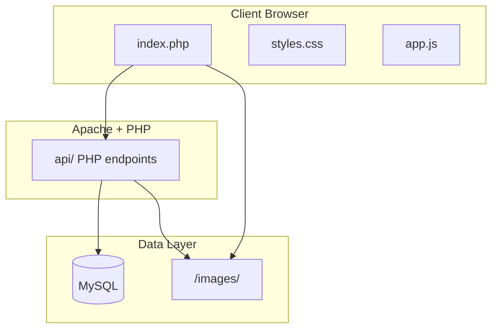
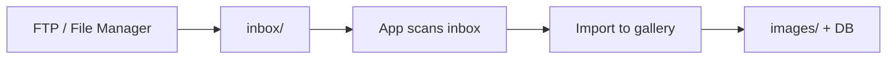

# PLAN B — ImageKpr (LAMP Stack)

## Architecture Overview




---

## 1. Why LAMP for ImageKpr


| Benefit           | Details                                                               |
| ----------------- | --------------------------------------------------------------------- |
| Native support    | Apache, PHP, MySQL included on most shared hosting (cPanel, Plesk)    |
| No build step     | Plain PHP files; edit and deploy via FTP                              |
| Beginner-friendly | Large community, abundant tutorials                                   |
| CMS compatibility | Same stack as WordPress; easy to integrate later                      |
| Scalability       | Add indexes, caching (APCu/Redis) later without changing architecture |


---

## 2. Project Structure

```
/imagekpr/
├── index.php             # Main page (HTML shell)
├── styles.css
├── app.js
├── config.php            # DB credentials (excluded from git)
├── api/
│   ├── images.php        # GET list (search, sort, pagination)
│   ├── stats.php         # GET dashboard stats (total, storage, last 10)
│   ├── upload.php        # POST upload
│   ├── delete.php        # DELETE single
│   ├── delete_bulk.php   # DELETE multiple
│   ├── download_bulk.php # GET zip of selected images
│   ├── tags.php          # PATCH tags (single or bulk)
│   ├── rename_bulk.php   # POST bulk rename
│   └── inbox.php         # GET pending, POST import (hot folder)
├── assets/
│   └── logo.svg          # ImageKpr logo (or placeholder)
├── scripts/
│   └── sync_images.php   # CLI: sync inbox → images + DB (hot folder)
├── images/               # Published images
├── inbox/                # Hot folder: drop via FTP, pending import
│   └── .htaccess         # Deny PHP execution
├── .htaccess             # Routing, CORS, caching
├── database.sql          # Schema for initial setup
└── README.md
```

---

## 3. MySQL Schema

**Database**: `imagekpr`

```sql
CREATE TABLE images (
  id INT AUTO_INCREMENT PRIMARY KEY,
  filename VARCHAR(255) NOT NULL UNIQUE,
  url VARCHAR(512) NOT NULL,
  date_uploaded DATETIME NOT NULL,
  size_bytes INT UNSIGNED NOT NULL,
  width INT UNSIGNED,
  height INT UNSIGNED,
  tags JSON,
  user_id INT NULL,
  created_at TIMESTAMP DEFAULT CURRENT_TIMESTAMP,
  INDEX idx_date (date_uploaded),
  INDEX idx_size (size_bytes),
  INDEX idx_filename (filename),
  INDEX idx_user (user_id),
  FULLTEXT INDEX idx_tags (tags)
) ENGINE=InnoDB DEFAULT CHARSET=utf8mb4;
```

- `user_id` nullable for future auth; NULL = no owner (current behavior). When auth is added, scope queries by `user_id`.
- Tags stored as JSON array: `["nature", "mountain"]`. For simple tag search without FULLTEXT, use `JSON_CONTAINS()` or a separate `image_tags` table if needed.

---

## 4. PHP Backend

### 4.1 config.php

- Define `DB_HOST`, `DB_NAME`, `DB_USER`, `DB_PASS`
- Define `IMAGES_DIR`, `IMAGES_URL`, `INBOX_DIR` (path to `inbox/` hot folder)
- Include `config.php` in API scripts; add `config.example.php` to repo (no secrets)

### 4.2 api/images.php (GET)

**Query params**: `page`, `per_page`, `sort` (date_desc, date_asc, size_desc, size_asc, name_asc, name_desc, random), `search`, `tag`

- Connect via PDO
- Build query with `WHERE` for search (filename LIKE) and tag filter (`JSON_CONTAINS(tags, ?)`)
- Apply `ORDER BY` from `sort`
- Paginate with `LIMIT` / `OFFSET`
- Return JSON: `{ images: [...], total: N, page: N }`

### 4.3 api/upload.php (POST)

- Accept `multipart/form-data`, field name `file` (or `files[]` for multiple)
- **Validation**:
  - MIME: Use `finfo_file()` with `FILEINFO_MIME_TYPE` (magic bytes) — allow `image/jpeg`, `image/png`, `image/gif`, `image/webp`
  - Size: Max 3MB (images intended for linking — keep lightweight)
  - Filename: `basename()`, sanitize to alphanumeric + `.-`_, reject `..`
- **Save**: Write to `IMAGES_DIR`; on collision append `-1`, `-2`, etc.
- **Metadata**: Use `getimagesize()` for width/height; `filesize()` for size_bytes
- **DB**: INSERT into `images` table
- **Response**: `{ success: true, image: {...} }` or `{ success: false, error: "..." }`
- Headers: `Content-Type: application/json`, CORS if needed

### 4.4 api/delete.php

- Accept `DELETE` or `POST` with `id` or `filename` (single)
- Verify file exists, delete file, DELETE from DB
- Return JSON success/error

### 4.4b api/delete_bulk.php

- Accept `POST` with `ids` (array of image IDs)
- For each: delete file, DELETE from DB
- Return `{ success: true, deleted: N }` or partial failure details

### 4.4c api/download_bulk.php

- Accept `GET` with `ids` (comma-separated) or `POST` with `ids` array
- Create ZIP on-the-fly (PHP ZipArchive), add selected images
- Return ZIP file; filename e.g. `imagekpr-export-YYYYMMDD.zip`

### 4.4d api/tags.php

- **PATCH** with `id` (single) or `ids` (array) and `tags` (array) or `action` (add/remove) + `tag`
- Update `tags` JSON column; support add tag, remove tag, replace all
- Return updated image(s)

### 4.4e api/rename_bulk.php

- **POST** with `ids` (array) and `base` (string) or `pattern`
- **Sequential numbering**: `{base}-{n}.{ext}` — e.g. `project-alpha-01.jpg`, `project-alpha-02.jpg`; order by `ids` array order (matches current sort)
- **Optional pattern** `search_replace`: `find` + `replace` — e.g. `IMG`_ → `photo`_ for all selected
- **Process**: For each image, sanitize new filename; `rename()` file on disk; UPDATE DB (`filename`, `url`); on collision append `-1`, `-2`
- Return `{ success: true, renamed: N, results: [{ id, old_filename, new_filename }, ...] }` or partial failure

### 4.5 api/stats.php (GET)

- Return JSON: `{ total_images: N, total_storage_bytes: N, total_storage_gb: "X.XX", last_10: [image, ...] }`
- `total_images`: `COUNT(*)` from images
- `total_storage_bytes`: `SUM(size_bytes)` from images
- `last_10`: 10 most recent images (ORDER BY date_uploaded DESC) with same fields as list response
- Used for hero dashboard; can be cached briefly (e.g. 60s) if needed

### 4.6 api/inbox.php (Hot folder)

- **GET**: Scan `INBOX_DIR` for `.jpg`, `.jpeg`, `.png`, `.gif`, `.webp` not yet in DB; return `{ pending: [filename, size, ...], count: N }`
- **POST**: Import selected or all — validate (MIME, 3MB), move from inbox to `IMAGES_DIR`, INSERT to DB; return `{ success: true, imported: N }`

### 4.7 scripts/sync_images.php (Hot folder CLI)

- `php scripts/sync_images.php` — scan `inbox/`, validate, move to `images/`, INSERT to DB
- Use for cron or manual import when UI not needed

---

## 5. Frontend (Unchanged from Original Plan)

Same UX as Plan A: vanilla JS, no frameworks.

### 5.1 index.php — Layout Structure

- Output HTML shell; include `styles.css` and `app.js`
- **Hero header** (top of page): Placeholder area for ImageKpr logo (`assets/logo.svg` or similar); clean, prominent
- **Mini dashboard** (below hero): Fetch from `api/stats.php` on load; display:
  - **Total images**: Count of all images
  - **Total storage**: Sum of `size_bytes` displayed in GB (e.g. "2.34 GB")
  - **Last 10 uploaded**: Horizontal row of small thumbnails (e.g. 48–64px); each thumbnail:
    - Click = copy URL; toast "Copied!"
    - Small expand icon (same as grid cards) = open full-size in modal
    - Same interaction pattern as main grid for consistency
- **Lists filter** (below dashboard): Dropdown "Show: All | Favourites | [List 2] | ..." — filter grid by selected list; "Manage lists" button opens management dialog
- **Main content** (below dashboard): Search, sort, upload zone, grid
- Initial data: Fetch `api/stats.php` and `api/images.php`; load lists from localStorage

### 5.2 Grid, Cards, Search, Sort, Upload UI

- Masonry via CSS columns
- Lazy loading with Intersection Observer
- **Debounce search: 1 second** (reduce API calls on rapid typing)
- **Load strategy**: Infinite scroll for first 1000 images; if total > 1000, switch to pagination (prev/next or page numbers)
- Drag-drop upload → `api/upload.php` via `fetch()` with `FormData`
- **Client-side validation**: max 3MB per image; Canvas resize to 1920px width if larger (keep images lightweight for linking)
- **Click card** = copy URL to clipboard; toast "Copied!"
- **Image card visual feedback**: Hover (e.g. subtle outline, border highlight, or slight scale) and active/click state (e.g. brief pressed or depressed effect) for clear affordance; use CSS transitions for smooth feedback
- **Star/bookmark icon** (on each card): toggle image in Favourites or selected list; uses `event.stopPropagation()`; filled when in list
- **Expand icon** (small icon on each card): opens full-size image in a modal; clicking icon uses `event.stopPropagation()` so it doesn't trigger copy
- **Modal** (full-size view): 4 action buttons —
  1. **Copy URL** — copies direct URL to clipboard; toast "Copied!"
  2. **Download** — triggers browser download of the image file
  3. **Delete** — confirm dialog, then delete; close modal, refresh grid
  4. **Close** — dismisses modal
  - **Tag edit** in modal: inline input or pills to add/remove tags for this image
  - **Visual feedback**: Hover and active/click states on all buttons
- **Dialogs & overlays** (modal, toast, confirmation): Match app's UI — same color palette, typography, spacing, border radius; visually cohesive and aesthetically pleasing
- **User hint**: Info text or tooltip near grid: "Click card to copy URL • Click icon to view full size"
- **Selection mode**: Checkbox on each card (or toolbar toggle); when enabled, user can select multiple images
- **Bulk actions bar** (when selection > 0): Delete selected, Download as ZIP, Edit tags (bulk add/remove), **Add to list** (dropdown), **Rename**
- **Rename dialog** (triggered from bulk bar): Base name input; optional pattern (sequential `{base}-{n}.{ext}` or search-replace); preview list before confirm; matches selection order
- **Tag edit per card**: Optional tag pills on card hover; click to add/remove tags

### 5.3 API Integration

- Stats/dashboard: `fetch('/api/stats.php')` — total images, total storage (GB), last 10 thumbnails
- Grid list: `fetch('/api/images.php?page=1&per_page=50&sort=date_desc')`
- Upload: `fetch('/api/upload.php', { method: 'POST', body: formData })`
- On successful upload: refetch `api/stats.php` to update dashboard
- Bulk delete: `POST api/delete_bulk.php` with `ids`
- Bulk download: `GET api/download_bulk.php?ids=1,2,3` or link with blob
- Bulk tags: `PATCH api/tags.php` with `ids` and `tags` or `action`+`tag`
- Bulk rename: `POST api/rename_bulk.php` with `ids`, `base` (or `pattern` with `find`/`replace`)
- Inbox: `GET api/inbox.php` (pending count), `POST api/inbox.php` (import)
- Lists: client-side only (localStorage); no API

### 5.4 Favourites & Lists (localStorage)

- **Storage**: `localStorage` key `imagekpr_lists` — JSON: `{ "Favourites": [1,2,3], "Project Alpha": [4,5] }` (list name → array of image IDs)
- **Add to list**: Star icon on card (toggle) adds/removes from "Favourites" by default, or from dropdown-selected list; bulk "Add to list" adds selected images to chosen list
- **Filter dropdown** (below dashboard): "Show: All | Favourites | [other lists]" — filters grid client-side by IDs in selected list
- **Manage lists dialog**:
  - List names with count, rename, delete
  - Create new list
  - Import: upload JSON file or paste JSON; merge or replace lists (user choice)
  - Export: download JSON file with current lists (backup/transfer to another device)
- **Import/export format**: `{ "Favourites": [1,2,3], "My List": [4,5] }` — list name → image IDs

---

## 6. Hot Folder (FTP) Workflow

### 6.1 Concept

A **hot folder** (`inbox/`) is a directory on the server where you drop images via FTP. The app treats these as "pending" until you import them. Use when you prefer to upload many files via FTP or external tools, then bring them into ImageKpr in one step.




### 6.2 Workflow Steps

1. **Drop images** into `inbox/` via FTP, cPanel File Manager, or any file transfer
2. **App recognizes** — dashboard or dedicated "Inbox" section shows "X images waiting"
3. **Review** (optional): List pending filenames, sizes; optionally discard ones you don't want
4. **Import** — click "Import all" or select specific files, then import
5. **On import**: Files are validated (MIME, 3MB), moved from `inbox/` to `images/`, and inserted into the database

### 6.3 Implementation


| Component                 | Purpose                                                   |
| ------------------------- | --------------------------------------------------------- |
| `inbox/`                  | Hot folder; user drops files here                         |
| `api/inbox.php` GET       | Returns list of pending files (not yet in DB)             |
| `api/inbox.php` POST      | Imports selected/all; moves to `images/`, INSERT to DB    |
| `scripts/sync_images.php` | CLI: same import logic for cron or manual run             |
| Dashboard badge           | "X pending" when inbox has files; link to inbox/import UI |


### 6.4 Config

- `INBOX_DIR` — path to `inbox/` (e.g. `__DIR__ . '/../inbox'`)
- Ensure `inbox/` is writable for FTP uploads; readable by PHP

### 6.5 Optional: Cron Auto-Import

```bash
# Run every 5 minutes
*/5 * * * * php /path/to/imagekpr/scripts/sync_images.php
```

Or rely on manual "Import" button in the app.

---

## 7. .htaccess

```apache
# Deny direct access to config
<Files "config.php">
  Require all denied
</Files>

# CORS (if API on same domain, optional)
<IfModule mod_headers.c>
  Header set Access-Control-Allow-Origin "*"
  Header set Access-Control-Allow-Methods "GET, POST, DELETE, OPTIONS"
  Header set Access-Control-Allow-Headers "Content-Type"
</IfModule>

# Caching
<FilesMatch "\.(jpg|jpeg|png|gif|webp)$">
  Header set Cache-Control "max-age=2592000, public"
</FilesMatch>

# Prevent PHP execution in uploads and inbox
<Directory "images">
  php_flag engine off
  AddType text/plain .php .phtml .php3 .php4 .php5
</Directory>
<Directory "inbox">
  php_flag engine off
  AddType text/plain .php .phtml .php3 .php4 .php5
</Directory>
```

---

## 7. Security Checklist


| Item                  | Implementation                                           |
| --------------------- | -------------------------------------------------------- |
| MIME validation       | `finfo_file()` magic bytes, not extension                |
| Filename sanitization | `basename()`, regex allow `[a-zA-Z0-9._-]`               |
| Size limit            | 3MB in PHP + align `upload_max_filesize` in php.ini      |
| Path traversal        | Reject `..`, use `realpath()` when resolving paths       |
| SQL injection         | PDO prepared statements                                  |
| XSS                   | `htmlspecialchars()` on output                           |
| Config exposure       | `.htaccess` deny `config.php`; `config.example.php` only |


---

## 9. README.md (LAMP Setup)

- **Prerequisites**: Linux, Apache 2.4+, PHP 7.4+ (8.x recommended), MySQL 5.7+ or MariaDB
- **PHP extensions**: `pdo_mysql`, `gd` or `imagick`, `fileinfo`, `json`, `zip` (for bulk download)
- **Setup**:
  1. Create DB and run `database.sql`
  2. Copy `config.example.php` → `config.php`, fill credentials
  3. Set `images/` and `inbox/` writable (775 or 755 + www-data)
  4. Point DocumentRoot to project
- **Shared hosting**: Create DB via cPanel; upload via FTP; ensure PHP version and extensions

---

## 10. Implementation Order

1. Create project structure and `database.sql`
2. Implement `config.php`, `api/images.php` (GET), and `api/stats.php`
3. Build `index.php` with hero header (logo placeholder) + mini dashboard (stats, last 10)
4. Add `styles.css` and `app.js` (dashboard stats fetch, last-10 row with copy + expand)
5. Build main grid, cards, fetch from `api/images.php`
6. Add search (1s debounce), sort, infinite scroll (up to 1000) + pagination fallback
7. Add expand icon + modal (Copy, Download, Delete, Close); tag edit in modal; user hint
8. Implement `api/upload.php` (3MB max) with validation and DB insert
9. Add upload UI (drag-drop, 3MB validation, Canvas resize if larger); on success, refetch stats
10. Selection mode + bulk actions bar (delete, download ZIP, bulk tags, **rename**); `api/delete_bulk.php`, `api/download_bulk.php`, `api/tags.php`, `api/rename_bulk.php`; rename dialog (base name + optional pattern, preview)
11. Hot folder: `inbox/`, `api/inbox.php`, dashboard "X pending" badge, import UI; `scripts/sync_images.php`
12. Favourites & lists: localStorage, filter dropdown, star on cards, bulk "Add to list", manage lists dialog (create/rename/delete, import/export)
13. Add lazy loading and performance tweaks; `.htaccess`, README

---

## 11. Future Roadmap: User Authentication

*Not implemented now; design decisions to ease migration.*

### 11.1 Schema additions (when auth is added)

- **images**: `user_id` already nullable; new uploads set `user_id`; existing rows stay NULL (treat as shared/legacy)
- **users**: `id`, `email`, `password_hash`, `created_at`, etc.
- **user_lists**: `id`, `user_id`, `name`, `created_at`
- **list_items**: `list_id`, `image_id` (replaces localStorage)

### 11.2 Migration path

- Add `getUserId()` (or similar) returning session user ID; when no auth, return null
- APIs: add `WHERE user_id = ? OR user_id IS NULL` (or equivalent) to scope by user
- Lists: import localStorage JSON into `user_lists` + `list_items` on first login
- File storage: keep flat `images/`; ownership in DB only

### 11.3 No changes needed now

- API routes and response formats stay the same
- List export format (`{ "Favourites": [1,2,3] }`) can seed DB
- Frontend: add login UI; APIs will return user-scoped data once auth is wired

---

## 12. Comparison: Plan A vs PLAN B


| Aspect         | Plan A (Original)    | PLAN B (LAMP)           |
| -------------- | -------------------- | ----------------------- |
| Data store     | manifest.json        | MySQL                   |
| Backend        | Perl CGI             | PHP                     |
| Upload handler | upload.pl            | api/upload.php          |
| FTP workflow   | generate_manifest.py | scripts/sync_images.php |
| Hosting        | Needs CGI + Perl     | Standard shared LAMP    |
| Scalability    | JSON file I/O        | SQL queries, indexes    |
| Beginner fit   | Lower (Perl, CGI)    | Higher (PHP common)     |


