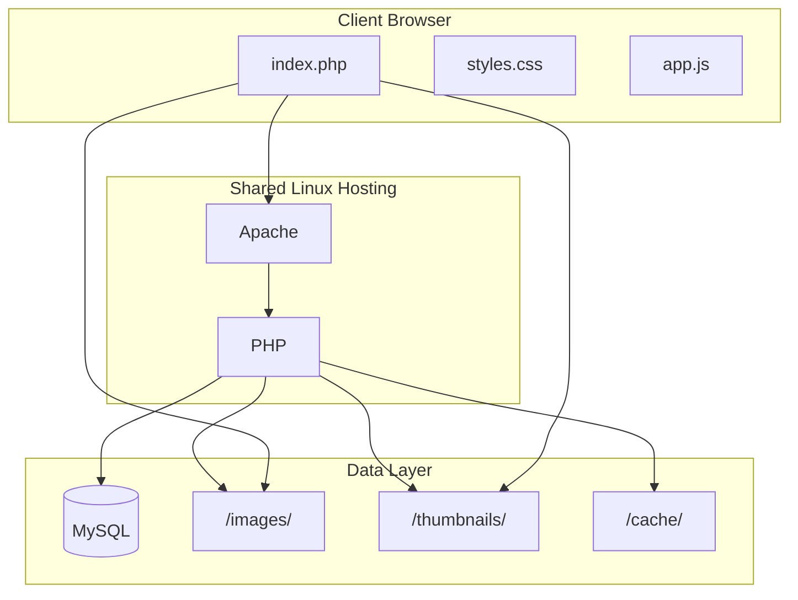

# PLAN C — ImageKpr (Robust & Shared Hosting)

## Architecture Overview




---

## 1. Why PLAN C — Design Principles


| Principle                 | Implementation                                                                                             |
| ------------------------- | ---------------------------------------------------------------------------------------------------------- |
| **Shared hosting**        | LAMP only — PHP, MySQL, Apache; no Docker, Node, or custom daemons; deploy via FTP/cPanel                  |
| **Robust**                | MySQL with indexes, PDO prepared statements, transactional writes, proper error handling                   |
| **High performance**      | Thumbnail generation on upload, file-based or APCu cache, optimized queries, long Cache-Control for images |
| **Images on same server** | Local filesystem in `images/` and `thumbnails/`; no Supabase, S3, or external storage                      |
| **Typical Linux hosting** | Works on cPanel, Plesk, and similar shared environments                                                    |


---

## 2. Stack Summary


| Layer            | Technology               | Rationale                                    |
| ---------------- | ------------------------ | -------------------------------------------- |
| Server           | Apache 2.4+              | Default on shared hosting                    |
| Backend          | PHP 7.4+ (8.x preferred) | Universal on shared Linux hosting            |
| Database         | MySQL 5.7+ / MariaDB     | Included in cPanel, Plesk                    |
| Cache            | File-based or APCu       | No Redis on shared; APCu if available        |
| Image processing | GD or Imagick            | Built-in PHP extensions                      |
| Frontend         | Vanilla HTML/CSS/JS      | No build step, same UX                       |
| Storage          | Local filesystem         | `images/` originals, `thumbnails/` generated |


---

## 3. Project Structure

```
/imagekpr/
├── index.php
├── styles.css
├── app.js
├── config.php
├── config.example.php
├── api/
│   ├── images.php        # GET list (search, sort, pagination)
│   ├── upload.php        # POST upload + thumbnail generation
│   └── delete.php        # DELETE (optional)
├── includes/
│   ├── db.php            # PDO connection
│   ├── cache.php         # File/APCu cache helpers
│   ├── imageProcessor.php # Thumbnail generation (GD/Imagick)
│   └── validation.php    # MIME, filename, size validation
├── images/               # Originals
├── thumbnails/           # Generated (400px max)
├── cache/                # API response cache (file-based)
├── scripts/
│   └── sync_images.php   # CLI: scan /images/, sync to DB (FTP workflow)
├── database.sql          # Schema
├── .htaccess
└── README.md
```

---

## 4. Database Schema (MySQL)

```sql
CREATE TABLE images (
  id INT AUTO_INCREMENT PRIMARY KEY,
  filename VARCHAR(255) NOT NULL UNIQUE,
  url VARCHAR(512) NOT NULL,
  thumbnail_url VARCHAR(512),
  date_uploaded DATETIME NOT NULL,
  size_bytes BIGINT UNSIGNED NOT NULL,
  width INT UNSIGNED,
  height INT UNSIGNED,
  tags JSON,
  created_at TIMESTAMP DEFAULT CURRENT_TIMESTAMP,
  INDEX idx_date (date_uploaded),
  INDEX idx_size (size_bytes),
  INDEX idx_filename (filename),
  FULLTEXT INDEX idx_tags (tags)
) ENGINE=InnoDB DEFAULT CHARSET=utf8mb4;
```

---

## 5. API Design

### 5.1 GET api/images.php

**Query params**: `page`, `per_page` (default 50), `sort`, `search`, `tag`

- Check cache: file `cache/list_{hash}.json` or `apcu_fetch()` with hash of query
- If miss: PDO query with `LIMIT`/`OFFSET`, `ORDER BY`, `WHERE` for search/tag
- Cache result (60s TTL)
- Return JSON: `{ images: [...], total: N, page: N }`

### 5.2 POST api/upload.php

- Accept `multipart/form-data`
- Validate: `finfo_file()` MIME, max 10MB, filename sanitization
- Save to `images/`; on collision append `-1`, `-2`, etc.
- Generate thumbnail (GD or Imagick): 400px max → `thumbnails/`
- INSERT into `images`; clear list cache
- Return: `{ success: true, image: {...} }`

### 5.3 DELETE api/delete.php (Optional)

- Accept `id` or `filename`
- Delete file, thumbnail, DB record; clear cache
- Return JSON success/error

---

## 6. Image Processing (PHP)


| Step       | Tool                                               | Purpose               |
| ---------- | -------------------------------------------------- | --------------------- |
| Validation | `finfo_file()`                                     | Magic-byte MIME check |
| Metadata   | `getimagesize()`                                   | Dimensions            |
| Thumbnail  | GD `imagecopyresampled()` or Imagick               | 400px max dimension   |
| Storage    | `move_uploaded_file()`, `imagejpeg()`/`imagepng()` | Write to disk         |


Prefer Imagick if available (better quality); fall back to GD. Store thumbnails as JPEG or WebP for smaller size.

---

## 7. Caching Strategy


| Type           | Implementation                                                                      |
| -------------- | ----------------------------------------------------------------------------------- |
| **List API**   | File cache: `cache/list_$hash.json` with 60s TTL; or `apcu_store()` if APCu enabled |
| **Images**     | Apache `Cache-Control: max-age=2592000` via .htaccess                               |
| **Thumbnails** | Same long TTL                                                                       |


Cache invalidation: delete cache files / `apcu_delete()` on upload and delete.

---

## 8. .htaccess

```apache
# Deny config and cache dir
<Files "config.php">
  Require all denied
</Files>

# Deny direct PHP in uploads
<Directory "images">
  php_flag engine off
</Directory>

# Caching for images and thumbnails
<FilesMatch "\.(jpg|jpeg|png|gif|webp)$">
  Header set Cache-Control "max-age=2592000, public"
</FilesMatch>

# CORS if needed
<IfModule mod_headers.c>
  Header set Access-Control-Allow-Origin "*"
  Header set Access-Control-Allow-Methods "GET, POST, DELETE, OPTIONS"
  Header set Access-Control-Allow-Headers "Content-Type"
</IfModule>
```

---

## 9. Frontend (Same UX)

- Vanilla JS; fetch from `api/images.php`
- Masonry CSS columns; lazy load thumbnails (`thumbnail_url` when present)
- Debounce search (300ms), pagination/infinite scroll
- Drag-drop upload → `POST api/upload.php`
- Client-side: 10MB validation, Canvas resize to 1920px before upload
- Click card = copy URL; toast "Copied!"

---

## 10. Deployment (Shared Hosting)


| Step | Action                                                                                |
| ---- | ------------------------------------------------------------------------------------- |
| 1    | Create MySQL database via cPanel/phpMyAdmin                                           |
| 2    | Run `database.sql`                                                                    |
| 3    | Copy `config.example.php` → `config.php`, fill DB credentials and paths               |
| 4    | Upload files via FTP or cPanel File Manager                                           |
| 5    | Set permissions: `images/` and `thumbnails/` writable (755 or 775); `cache/` writable |
| 6    | Point domain or subdomain to project root                                             |
| 7    | Verify PHP extensions: `pdo_mysql`, `gd` or `imagick`, `fileinfo`, `json`             |


**Compatibility**: cPanel, Plesk, and most Linux shared hosts with PHP 7.4+ and MySQL.

---

## 11. Security Checklist


| Item                  | Implementation                                                  |
| --------------------- | --------------------------------------------------------------- |
| MIME validation       | `finfo_file()` magic bytes                                      |
| Filename sanitization | `basename()`, allow `[a-zA-Z0-9._-]`                            |
| Size limit            | 10MB in PHP; align `upload_max_filesize` in php.ini if possible |
| Path traversal        | Reject `..`, use `realpath()`                                   |
| SQL injection         | PDO prepared statements                                         |
| XSS                   | `htmlspecialchars()` on output                                  |
| Config exposure       | `.htaccess` deny; exclude `config.php` from repo                |


---

## 12. Performance Optimizations


| Optimization         | Purpose                                         |
| -------------------- | ----------------------------------------------- |
| Thumbnail generation | Smaller grid images, faster load                |
| File/APCu cache      | Fewer DB hits for list API                      |
| DB indexes           | Fast sort/filter on date, size, filename        |
| Lazy loading         | Defer off-screen images                         |
| Pagination           | Limit rows, avoid loading 10k+ at once          |
| Cache-Control        | Long TTL for images; short for API              |
| Gzip                 | Enable via `php.ini` or .htaccess `mod_deflate` |


---

## 13. Comparison: Plan A / B / C


| Aspect      | Plan A            | Plan B (LAMP) | PLAN C (Shared)          |
| ----------- | ----------------- | ------------- | ------------------------ |
| Data store  | manifest.json     | MySQL         | MySQL                    |
| Backend     | Perl CGI          | PHP           | PHP                      |
| Images      | Local             | Local         | Local + thumbnails       |
| Deploy      | Shared + CGI      | Shared LAMP   | Shared LAMP              |
| Performance | JSON I/O          | SQL           | SQL + thumbnails + cache |
| Target      | CGI-capable hosts | Shared LAMP   | Shared Linux hosting     |
| Robustness  | Basic             | Good          | High (cache, thumbnails) |


---

## 14. Implementation Order

1. Project structure, `config.php`, `database.sql`
2. `includes/db.php` and `api/images.php` (GET)
3. `index.php`, `styles.css`, `app.js` (grid, fetch from API)
4. Search, sort, pagination in API and frontend
5. `includes/validation.php` and `includes/imageProcessor.php`
6. `api/upload.php` with validation, thumbnail generation, DB insert
7. `includes/cache.php` and wire cache into list endpoint
8. Upload UI (drag-drop, client validation, resize)
9. `api/delete.php`, `scripts/sync_images.php`
10. `.htaccess`, README with shared hosting setup

