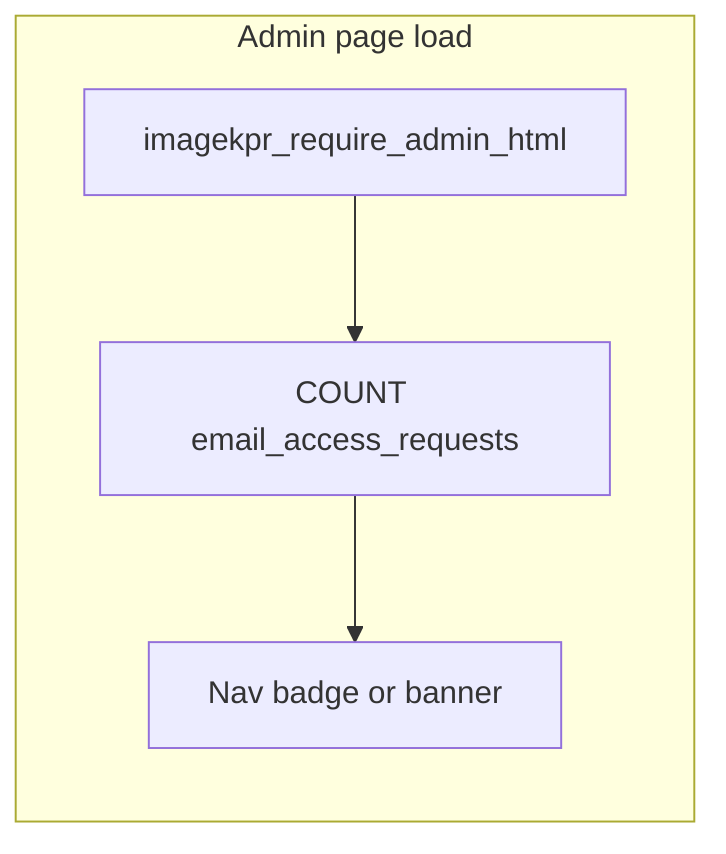

# Allowlist management at scale (search, sort, bulk, alerts)

## Current behavior

- [admin/allowlist.php](admin/allowlist.php) loads **all** rows from `email_allowlist` (`ORDER BY email ASC`) and `email_access_requests` (`ORDER BY created_at ASC`) — fine for tens of rows, unwieldy at ~1000.
- Single-row actions only: `allowlist_delete`, `access_request_approve`, `access_request_dismiss` (CSRF already enforced).
- Admin UX already has session flash “toasts” (`.admin-toast`); [admin/_nav.php](admin/_nav.php) has no pending indicator.

Schema reference: [migrations/phase14_access_requests.sql](migrations/phase14_access_requests.sql), [database.sql](database.sql) (`email_allowlist`, `email_access_requests`).

---

## 1. Search, sort, pagination (server-side)

**Approach:** Use **GET query parameters** on `allowlist.php` (e.g. `allow_q`, `allow_sort`, `allow_page` and `pend_q`, `pend_sort`, `pend_page`) so URLs are bookmarkable and back/forward work. Keep defaults sensible (e.g. pending: newest first; allowed: A–Z).

- **Search:** `WHERE email LIKE ?` with a bound value `'%' . escaped_literal . '%'` (escape `%`/`_`). For pending only, optionally also match `note` with `OR note LIKE ?`.
- **Sort (whitelist only — never interpolate column names from user input):** map a small enum to SQL fragments, e.g. `email_asc` → `ORDER BY email ASC`, `email_desc`, `created_asc`, `created_desc`.
- **Pagination:** `LIMIT :limit OFFSET :offset` with `per_page` capped (e.g. 25–100, default 50). Run a separate `COUNT(*)` with the same `WHERE` for total pages.
- **UI:** compact toolbar above each table (search input, sort `<select>`, page controls / “Showing X–Y of Z”). Preserve other POST flows (add email, toggles) via hidden fields or redirect back to the same GET query after POST (303 redirect with query string).

**Performance:** 1k rows is small for MySQL; indexes help sorts and counts. Add a migration (e.g. `migrations/phase18_allowlist_indexes.sql`) with:

- `email_allowlist`: index on `created_at` (sort-by-date).
- `email_access_requests`: index on `created_at` (sort/filter by time).

Unique indexes on `email` already support equality lookups; `LIKE '%foo%'` will still scan but is acceptable at this scale.

---

## 2. Bulk remove / bulk dismiss

**Allowed list**

- New POST action e.g. `allowlist_bulk_delete` with `allowlist_ids[]` (integers), CSRF, `imagekpr_admin_audit_log` per row or one summary entry (match existing audit style in this file).
- Validate each id exists before `DELETE`; cap batch size (e.g. max 200 per request) to avoid timeouts.
- UI: column of checkboxes, “Select all on this page”, **Remove selected** with `confirm()`.

**Pending requests**

- Parallel action e.g. `access_request_bulk_dismiss` with `request_ids[]` (or bulk **approve** later if you want parity — out of scope unless you ask for it).

Optional: **bulk approve** uses the same pattern as single approve (`INSERT IGNORE` + `DELETE`) in a transaction.

---

## 3. “How many waiting?” — in-app (recommended baseline)

**No cron required** for admins who open the panel:

- Add a tiny helper in [inc/admin.php](inc/admin.php), e.g. `imagekpr_email_access_request_count(PDO $pdo): int` — `SELECT COUNT(*) FROM email_access_requests` in try/catch (return 0 if table missing).
- Include a **non-flash** banner or nav affordance on all admin pages:
  - **Option A (minimal):** extend [admin/_nav.php](admin/_nav.php) to show a badge on the Allowlist link when count &gt; 0, e.g. `Allowlist (3)`.
  - **Option B (toast-like):** after `_nav.php`, render a dismissible info strip (session flag `admin_hide_pending_banner` set by POST or query param) when count &gt; 0: “3 access request(s) waiting — [Review](allowlist.php#pending-heading)”.
- This is one cheap `COUNT(*)` per admin page load — negligible vs HTML rendering.

---

## 4. Scheduled alerts (9:00 / 12:00 / 15:00) — optional CRON

**When to use:** Admins who are **not** in the app often and want email (or similar) reminders.

**Implementation sketch**

- New CLI script under `scripts/`, e.g. `scripts/pending_access_digest.php`, bootstrap same config/PDO as other scripts, read count; if `CONTACT_TO_EMAIL` is set ([inc/contact_mail.php](inc/contact_mail.php) pattern), send plain-text `mail()` with subject like `[ImageKpr] N pending access request(s)` and link to `/admin/allowlist.php`.
- **Cron** (server local time — document in comment):  
  `0 9,12,15 * * * /usr/bin/php /path/to/scripts/pending_access_digest.php`
- **Anti-spam (optional):** store `last_pending_digest_sent_at` + `last_pending_digest_count` in `app_settings` and skip if count unchanged since last send, or only send when count &gt; 0 and `created_at` has new rows since last run — pick one policy and document it.

**Alternatives to cron:** external uptime monitor hitting a **secret URL** that triggers the same email (less ideal security-wise unless strongly authenticated); or push (Slack webhook) using the same script body.

---

## 5. Files to touch (concise)

| Area | Files |
|------|--------|
| List logic + forms | [admin/allowlist.php](admin/allowlist.php) |
| Shared count helper | [inc/admin.php](inc/admin.php) |
| Nav / banner | [admin/_nav.php](admin/_nav.php) + small include or inline in each admin layout (index, config, updates already duplicate styles — prefer one include to avoid drift) |
| Indexes | new `migrations/phase18_allowlist_indexes.sql` (name as you prefer) |
| Optional digest | `scripts/pending_access_digest.php` + README/cron one-liner in comment at top of script |

---

## Recommendation summary

- **Must-have for 1000 users:** server-side **search + sort + pagination** and **bulk delete/dismiss**.
- **Best “toast” UX without infrastructure:** **nav badge + optional dismissible banner** driven by `COUNT(*)` on every admin load.
- **9/12/3pm reminders:** **cron + PHP CLI script + `mail()`** if email is already reliable on the host; otherwise rely on in-app cues only or a third-party scheduler hitting a secured endpoint.
