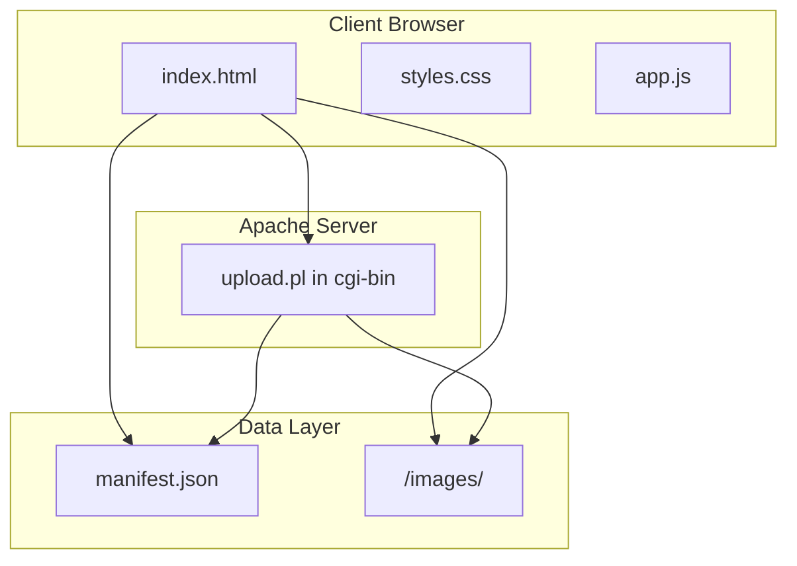

# ImageKpr Implementation Plan

## Architecture Overview




---

## 1. Project Structure

```
/imagekpr.com/
├── index.html           # Main SPA (HTML + inline or linked CSS/JS)
├── styles.css           # Extracted for maintainability (optional inline)
├── app.js               # Extracted for maintainability (optional inline)
├── manifest.json        # Image metadata database (initial: empty images array)
├── upload.pl            # CGI script → deploy to cgi-bin/
├── generate_manifest.py # Optional: FTP workflow manifest rebuilder
├── .htaccess            # Apache config: CGI, CORS, caching
├── README.md            # Setup instructions
└── images/              # Uploaded images directory
    └── .gitkeep
```

**Payload strategy**: Keep `index.html` as single file with inline CSS/JS to minimize requests; or split into 3 files if total remains under 500KB and improves maintainability. CSS columns masonry is lightweight (~no extra JS); avoid Masonry.js unless needed—pure CSS columns handle masonry well for this use case.

---

## 2. manifest.json Schema

Initial file structure:

```json
{
  "version": "1.0",
  "last_updated": "2024-01-15T10:30:00Z",
  "images": []
}
```

Each image object: `id`, `filename`, `url`, `date_uploaded`, `size_bytes`, `tags` (array), `width`, `height`. ID = sanitized filename or UUID on collision.

---

## 3. Frontend Implementation

### 3.1 HTML Shell

- Semantic structure: `header` (title, search, sort, upload zone), `main` (grid container), `footer` (refresh button, optional)
- Single `<div id="grid">` for masonry columns; each card = `<article>` with `data-id`, `data-url`, `data-filename`
- Inline SVGs for: upload icon, copy, search, sort arrow, refresh, delete (if implemented)
- Form: `<input type="file" accept="image/*" multiple>` + drag-drop zone overlay

### 3.2 Masonry Layout

- **CSS columns**: `#grid { column-count: auto; column-width: 280px; }` — cards flow vertically per column; no JS library needed
- Responsive breakpoints: 1 col (mobile <600px), 2–3 cols (tablet), 4+ cols (desktop)

### 3.3 Grid Cards

- Each card: thumbnail ``, filename (truncated with CSS `text-overflow: ellipsis`), human-readable size, upload date
- Hover overlay: semi-transparent layer, "Copy URL" button, tags as pills (if `tags.length > 0`)
- Click card = copy URL to clipboard; show toast "Copied!"

### 3.4 Search & Sort

- Search: `<input type="search">` with 300ms debounce; filter by `filename` and `tags.join(' ')`
- Sort: `<select>` — Date Newest/Oldest, Size Largest/Smallest, Filename A–Z/Z–A, Random
- Tag filter: optional `<select>` or pill clicks to filter by tag

### 3.5 Upload Interface

- Drag-drop zone: `dragover`/`dragleave`/`drop` events; `accept="image/jpeg,image/png,image/gif,image/webp"`
- Client-side validation: max 10MB per file; reject oversized
- Pre-upload resize: Canvas API — if `width > 1920`, scale proportionally before `FormData` append
- Progress: `XMLHttpRequest.upload.onprogress` or `fetch` + `ReadableStream` progress polyfill; show progress bar
- On success: append new image to grid + update in-memory manifest; optional full manifest refetch

### 3.6 Performance (10,000+ images)

- **Lazy loading**: `IntersectionObserver` for ``; swap to `src` when in viewport
- **Pagination or virtual scrolling**: Render only ~50–100 visible cards; append more on scroll (infinite scroll or "Load more" button) to avoid DOM bloat
- Debounce search (300ms)
- Manifest cached in memory; manual "Refresh" button to refetch `manifest.json`

### 3.7 Accessibility

- `alt` on all images (use filename or "Image: {filename}")
- Focus states on buttons and inputs (`:focus-visible`)
- Keyboard: Tab through controls; Enter to copy URL when card focused

---

## 4. Backend: upload.pl (Perl CGI)

### 4.1 Environment & Headers

- Shebang: `#!/usr/bin/perl`
- `use CGI; use strict; use warnings;`
- Output: `Content-Type: application/json`
- CORS: `Access-Control-Allow-Origin:` * (or restrict to domain) if served from different origin

### 4.2 Request Handling

- Only accept `POST` with `multipart/form-data`
- Parse `CGI->param('file')` or `CGI->upload('file')` for each file

### 4.3 Validation

- **MIME type**: Use `File::Type` or read magic bytes (JPEG: `FF D8 FF`; PNG: `89 50 4E`; GIF: `47 49 46`; WebP: `52 49 46 46 ... 57 45 42 50`) — do NOT trust `Content-Type` header alone
- **Size**: Max 10MB (10,485,760 bytes)
- **Filename sanitization**: Remove path components, strip non-alphanumeric except `.-_`, limit length; prevent path traversal

### 4.4 File Save

- Target: `../images/` relative to cgi-bin (e.g. `/var/www/imagekpr/cgi-bin/upload.pl` → `/var/www/imagekpr/images/`)
- On collision: append `-1`, `-2`, etc. or use short UUID prefix
- Ensure directory exists and is writable

### 4.5 Metadata

- Use `Image::Size` (`imgsize()`) to get `width` and `height`
- `size_bytes`: `-s $filepath`
- `date_uploaded`: ISO 8601 UTC

### 4.6 Manifest Update (Atomic)

1. Read current `manifest.json` (lock if possible)
2. Decode JSON, append new image object to `images` array
3. Write to temp file `manifest.json.tmp`
4. Rename `manifest.json.tmp` → `manifest.json` (atomic on POSIX)

### 4.7 Response

- Success: `{"success": true, "image": {...}}`
- Error: `{"success": false, "error": "message"}`

### 4.8 Perl Dependencies

- `CGI` (core)
- `Image::Size` (CPAN: `cpan Image::Size`)
- `File::Type` or custom magic-byte check for MIME validation
- `JSON` (CPAN: `cpan JSON`)

---

## 5. generate_manifest.py

- Scan `./images/` for: `.jpg`, `.jpeg`, `.png`, `.gif`, `.webp`
- For each: get dimensions (PIL/Pillow `Image.open()`), `os.path.getsize()`, `os.path.getmtime()` for date
- Build `images` array; write `manifest.json` with `version`, `last_updated` (now), `images`
- CLI: `python generate_manifest.py` from project root
- Optional: `--images-dir`, `--manifest-path` arguments

---

## 6. .htaccess

```apache
# Enable CGI
Options +ExecCGI
AddHandler cgi-script .pl

# CORS for clipboard/cross-origin (if needed)
<IfModule mod_headers.c>
  Header set Access-Control-Allow-Origin "*"
  Header set Access-Control-Allow-Methods "GET, POST, OPTIONS"
  Header set Access-Control-Allow-Headers "Content-Type"
</IfModule>

# Caching for manifest (short TTL) and images (long TTL)
<FilesMatch "manifest\.json">
  Header set Cache-Control "max-age=60, must-revalidate"
</FilesMatch>
<FilesMatch "\.(jpg|jpeg|png|gif|webp)$">
  Header set Cache-Control "max-age=2592000, public"
</FilesMatch>
```

---

## 7. README.md

- **Prerequisites**: Apache 2.4, Perl 5.32.1, mod_cgi, mod_headers
- **File permissions**: `upload.pl` executable (755); `images/` writable (775 or 755 + www-data write); `manifest.json` writable (664)
- **Deployment**: Place files; configure DocumentRoot and ScriptAlias for cgi-bin; test upload endpoint
- **Perl modules**: `cpan Image::Size JSON`
- **Optional**: Python 3 + Pillow for `generate_manifest.py`

---

## 8. Security Checklist


| Item                  | Implementation                    |
| --------------------- | --------------------------------- |
| MIME validation       | Magic-byte check, not extension   |
| Filename sanitization | Strip path, allow only safe chars |
| Size limit            | 10MB server-side in Perl          |
| Path traversal        | Reject `..` in filenames          |
| Atomic manifest write | Temp file + rename                |


---

## 9. File Size Budget (Target <500KB)

- `index.html` + inline CSS + JS: ~15–25KB (minified)
- `styles.css`: ~3–5KB
- `app.js`: ~12–18KB (lazy load, debounce, resize, upload, virtual scroll)
- `upload.pl`: ~4–6KB
- `generate_manifest.py`: ~2–3KB
- Total: well under 500KB

---

## 10. Implementation Order

1. Create project structure and initial `manifest.json`
2. Build `index.html` with layout, cards, search, sort (no upload)
3. Add lazy loading, debounce, pagination/virtual scroll
4. Implement upload UI (drag-drop, validation, client resize)
5. Implement `upload.pl` with validation and manifest update
6. Wire frontend upload to CGI; test end-to-end
7. Add `generate_manifest.py`
8. Add `.htaccess` and `README.md`

