# ImageKpr Feasibility Study and Implementation Plan

## Feasibility Summary

**Result: Feasible** — No critical conflicts identified. All requested changes can be implemented within the existing architecture. Auth (Phase 7) and global folders (Phase 8) require new backend work; the rest are UI/UX changes. Auth enables per-user spaces for family/friends.

---

## Feasibility Findings by Area

### 1. HERO HEADER — Feasible

- **Current**: [index.php](index.php) lines 10–24, [styles.css](styles.css) lines 5–11. Logo 40% width, upload zone; dashboard section below with stats + search.
- **Conflicts**: None. Stats are fetched by `loadStats()`; we can retain the fetch for the hint banner while removing the dashboard DOM.
- **Note**: "Resize hero image to 50% smaller" — logo is in `.logo img` with `max-width: 100%`. Reducing `.logo` from 40% to ~20% (or adding `max-width: 50%` on the img) achieves this.

### 2. FOLDERS — Feasible (with caveats)

**Folder qty not updating:**

- **Cause**: In [folders.js](folders.js) line 58, `removeFromFolder` uses `x !== id`. Stored IDs can be mixed number/string; strict equality fails.
- **Fix**: Use `Number(x) !== Number(id)` in the filter.
- **Impact**: Low; localized fix.

**Global folders (persistent across devices):**

- **Current**: [folders.js](folders.js) uses `localStorage` only.
- **Requirement**: Backend storage. Needs new DB tables and API. Implemented in Phase 8, after Auth (Phase 7).
- **Suggested schema**:
  - `folders` table: `id`, `user_id`, `name`, `created_at`
  - `folder_images` junction: `folder_id`, `image_id`
- **New API**: `api/folders.php` — GET (list + counts), POST (create), PATCH (add/remove images), DELETE (folder). All scoped by `user_id`.
- **Migration**: One-time import from localStorage on first load, or manual export/import.
- **Scope**: Medium–high; Phase 8.

### 3. STICKY HINT BANNER — Feasible

- **Current**: [index.php](index.php) 66–87, [app.js](app.js) 234–245, 1066–1069. "Enter Selection Mode" button, hint text, selection banner.
- **Conflicts**: None. Banner structure and `updateBulkBar` can stay; we change visibility rules and copy.
- **Data for hints**: "X images" from `gridState.total` or DOM count; "folder-name" from `folder-filter`; "Y GB" from stats (keep `loadStats` but move storage into a variable); "tags" from `gridState.tagFilter`.

### 4. GRID — Feasible

- **Current**: [app.js](app.js) 266–324 (renderCard), 313–321 (click: copy vs expand); [styles.css](styles.css) 141–157 (grid 220px, card styles).
- **Changes**: Click opens modal (not copy); expand icon → Copy URL icon; 5px hover outline; 180px grid; 20% smaller fonts; checkbox always visible.
- **Conflict**: Checkbox visibility — currently toggled by selection mode. Task: always show checkbox; checking it shows selection banner (implicit selection mode). Remove explicit "Enter Selection Mode" button.
- **Bulk bar labels**: Change "Edit tags" → "Manage Tags"; consolidate "Add to folder" / "Remove from folder" → "Manage Folders" (single modal).

### 5. IMAGE MODAL — Feasible

- **Current**: [index.php](index.php) 93–120, [app.js](app.js) 339–411. Add-tag input, folder pills with remove.
- **Tag bug**: `updateImageTags` updates server and `currentModalImg.tags` but not the card DOM. Cards are rendered once. **Fix**: After tag update, either update the card in place (find by `data-id`, refresh tags HTML) or call `refreshGrid(false)`.
- **Manage Tags/Folders modals**: Reuse `addTagDialog`/`addToFolderSelectDialog` patterns; create "Manage Tags" modal (add + remove) and "Manage Folders" modal (add + remove).
- **Layout**: Use CSS/media or JS to detect image aspect ratio; position actions below (wide) vs right (square/tall); keep filename below.

### 6. UPLOAD & INBOX — Feasible

- **Upload confirm modal**: No per-image rename today. Add rename (and bulk rename). Replace inline tags/folder with "Manage Tags" and "Manage Folders" buttons. Replace remove button with red "×" + tooltip + confirmation; no API delete for upload modal (files stay on client).
- **Inbox import modal**: Has per-image rename. Add bulk rename. Replace tags input + folder select with "Manage Tags" / "Manage Folders" buttons. Replace remove with red "×" + confirmation. **Critical**: Remove must NOT call inbox delete API — only remove from current import list; file stays in inbox for future review.
- **New folder in inbox**: When creating a folder during inbox import, other rows still use old folder list. **Fix**: After adding folder, refresh folder options in all rows (e.g. re-render list or update selects).

---

## Implementation Order

Recommended sequence to minimize rework and validate incrementally.

```mermaid
flowchart TD
    subgraph phase1 [Phase 1: Layout & Structure]
        A1[Hero: resize logo 50%, remove dashboard section]
        A2[Move Search to Sticker Hint Banner]
        A3[Update hint text format]
    end

    subgraph phase2 [Phase 2: Banner & Selection UX]
        B1[Remove Enter Selection Mode button]
        B2[Checkbox always visible, implicit selection mode]
        B3[Selection banner replaces hint when items selected]
    end

    subgraph phase3 [Phase 3: Grid & Cards]
        C1[Click opens modal instead of copy]
        C2[Expand icon to Copy URL, prominent feedback]
        C3[5px hover outline, 180px grid, 20% smaller fonts]
    end

    subgraph phase4 [Phase 4: Modals]
        D1[Manage Tags modal - image modal]
        D2[Manage Folders modal - image modal]
        D3[Fix tag sync to cards]
        D4[Modal layout: wide vs tall]
    end

    subgraph phase5 [Phase 5: Bulk Actions]
        E1[Rename bulk bar: Manage Tags, Manage Folders]
        E2[Implement Manage Tags/Folders for selection]
    end

    subgraph phase6 [Phase 6: Upload & Inbox]
        F1[Upload modal: rename, Manage Tags/Folders, red x]
        F2[Inbox modal: same UX, remove without delete]
        F3[Fix new folder not appearing in other rows]
    end

    A1 --> A2 --> A3 --> B1 --> B2 --> B3 --> C1
    C1 --> C2 --> C3 --> D1 --> D2 --> D3 --> D4
    D4 --> E1 --> E2 --> F1 --> F2 --> F3
```

---

## Step-by-Step Implementation Plan

### Phase 1: Hero and Layout

1. **Resize hero image** — In [styles.css](styles.css): reduce `.logo` width (e.g. 40% → 20%) or add `max-width: 50%` to `.logo img`.
2. **Remove dashboard stats** — In [index.php](index.php): remove or hide `.dashboard-stats` (total images, storage). Keep `loadStats()` but store result in a variable for the hint banner.
3. **Move Search to hint banner** — Move `#search` from `.dashboard-top-row` into `.banner-row` (or equivalent). Ensure it sits on the same row as the hints, after them.
4. **Update hint text** — Implement: "Showing 'X' images from 'folder-name' | 'Y GB storage used | with these 'tags' (or 'no tags selected')". Use `gridState.total`, `folder-filter` value, cached stats, and `gridState.tagFilter`.

### Phase 2: Sticky Banner and Selection

1. **Remove Enter Selection Mode button** — Remove `#select-mode` from [index.php](index.php) and its handler in [app.js](app.js).
2. **Checkbox always visible** — In `renderCard`, change checkbox from `display: (selectMode ? 'inline-block' : 'none')` to always visible.
3. **Implicit selection mode** — Treat `selectMode` as true whenever `selectedIds.size > 0`. Show selection banner instead of hint banner when `selectedIds.size > 0`.
4. **Update hint when not selecting** — When `selectedIds.size === 0`, show the new hint format; when > 0, show selection banner.

### Phase 3: Grid and Cards

1. **Click opens modal** — In `renderCard` inner click handler: when not in selection mode, call `openModal(img)` instead of `copyUrl(img.url)`.
2. **Replace expand icon with Copy URL** — Change `.card-expand` to a copy icon; on click, call `copyUrl` with a more prominent toast (e.g. longer, stronger styling).
3. **Styling** — In [styles.css](styles.css): `card-inner:hover` outline 5px; grid `minmax(220px, 1fr)` → `minmax(180px, 1fr)`; reduce app fonts by 20% (base or targeted rules).

### Phase 4: Image Modal

1. **Manage Tags** — Replace "Add tag" input with "Manage Tags" button that opens a modal: list current tags (with remove), add from existing or new. Reuse patterns from `addTagDialog`.
2. **Manage Folders** — Add "Manage Folders" button opening a modal: list current folders (remove), add to existing or new. Reuse `addToFolderSelectDialog` pattern.
3. **Fix tag sync to cards** — In `updateImageTags`, after success, find the card by `data-id` and update its `.card-tags` HTML, or call `refreshGrid(false)`.
4. **Modal layout** — Add logic or CSS so that for wide images, actions sit below; for square/tall, actions sit to the right. Keep filename/rename below the image.

### Phase 5: Bulk Actions

1. **Rename bulk buttons** — Change "Edit tags" → "Manage Tags", consolidate folder actions into "Manage Folders".
2. **Manage Tags for selection** — Open a Manage Tags-style modal for selected images; apply add/remove to all via `api/tags.php` PATCH.
3. **Manage Folders for selection** — Open a Manage Folders-style modal for selected images; support add/remove via `ImageKprFolders` (or future API).

### Phase 6: Upload and Inbox Modals

1. **Upload modal: rename** — Add per-image rename input and optional bulk rename.
2. **Upload modal: Manage Tags/Folders** — Replace inline controls with "Manage Tags" and "Manage Folders" buttons per item.
3. **Upload modal: remove** — Replace remove button with red "×", tooltip "Remove image", confirmation; do not upload that file (no server delete).
4. **Inbox modal: same UX** — Align with upload modal: Manage Tags, Manage Folders, red "×".
5. **Inbox remove behavior** — Remove from `pendingItems` only; do not call `inbox.php` delete. File stays in inbox for future sessions.
6. **New folder in inbox** — After creating a folder in inbox import, refresh folder options in all rows (re-render list or update selects).

### Phases 7–8: Auth and Global Folders (On Hold)

See separate plan: [imagekpr_auth_and_global_folders.plan.md](.cursor/plans/imagekpr_auth_and_global_folders.plan.md)

---

## Risks and Mitigations

| Risk                          | Mitigation                                                            |
| ----------------------------- | --------------------------------------------------------------------- |
| Modal layout breakpoints      | Use aspect-ratio or width thresholds; test with various image sizes.  |
| Inbox "remove" confusion      | Clear copy: "Skip for now – file stays in inbox for later".           |
| Orphan images at auth cutover | Run migration to assign `user_id` to first user; document for deploy. |

---

## Files to Modify

- [index.php](index.php) — Structure, search placement, dashboard, modals, logout link, auth redirect
- [styles.css](styles.css) — Hero, grid, cards, fonts, modal layout
- [app.js](app.js) — All behavior changes, 401 redirect to login
- [folders.js](folders.js) — `removeFromFolder` fix, API usage for global folders (Phase 8)
- [database.sql](database.sql) — Add `users` table (Phase 7), `folders` + `folder_images` (Phase 8)
- **New**: `login.php`, `register.php`, `logout.php`
- **New**: `inc/auth.php` — session check, redirect/401
- **New**: `api/folders.php` (Phase 8)
- **Modify**: All `api/*.php` — add `require inc/auth.php`, scope by user_id

---

## Preserved Behavior

- Upload flow, resize, and progress
- Search, sort, tag filter, folder filter
- Infinite scroll and pagination
- Image modal rename, download, delete
- Bulk delete, download ZIP, rename
- Inbox import with tags/folders
- Toast notifications and confirm dialogs

