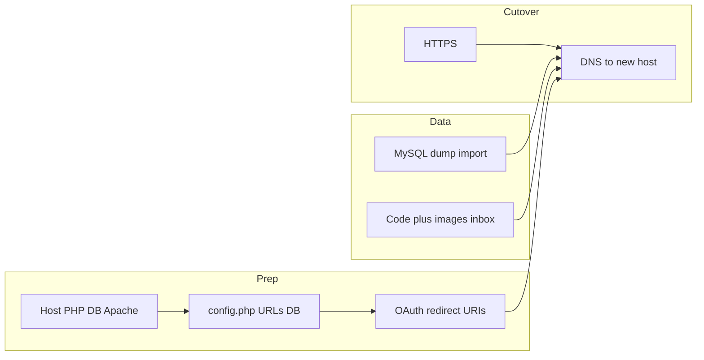

# Migrate ImageKpr to imagekpr.com hosting

## What you are moving

This project is a **LAMP** app (PHP + MySQL, Apache-friendly) with **no Composer/build step** ([README.md](c:\Users\googo\Dropbox\_APC\__Current Jobs (APC)\260307 - ImageKpr\README.md)). Runtime needs:

- **PHP** 7.4+ (8.x recommended), extensions: `pdo_mysql`, `gd` *or* `imagick`, `fileinfo`, `json`, `zip`
- **MySQL** 5.7+ or MariaDB
- **Apache** with `mod_rewrite` (and ideally `mod_headers` for cache headers in [.htaccess](c:\Users\googo\Dropbox\_APC\__Current Jobs (APC)\260307 - ImageKpr\.htaccess))

**Three pillars to migrate:** application files, **MySQL database**, and **uploaded files** under `images/` (and optionally `inbox/`).

---

## 1. Confirm the new host can run the app

- Verify PHP version and enabled extensions (control panel or a one-line `phpinfo()` page you delete afterward).
- Check **`upload_max_filesize`** and **`post_max_size`**. The README mentions 3MB as a baseline; the codebase also supports **larger per-user upload tiers** (see [migrations/phase16_upload_tier_100mb.sql](c:\Users\googo\Dropbox\_APC\__Current Jobs (APC)\260307 - ImageKpr\migrations\phase16_upload_tier_100mb.sql)) — if any account can upload up to 100MB, PHP limits on the new server must be **at least** that maximum.
- Confirm **cron/SSH** if you rely on [scripts/sync_images.php](c:\Users\googo\Dropbox\_APC\__Current Jobs (APC)\260307 - ImageKpr\scripts/sync_images.php) for inbox imports (optional env `IMAGEKPR_SYNC_USER_ID`).

---

## 2. Prepare `config.php` on the new server

Copy [config.example.php](c:\Users\googo\Dropbox\_APC\__Current Jobs (APC)\260307 - ImageKpr\config.example.php) to `config.php` (never commit it; [.htaccess](c:\Users\googo\Dropbox\_APC\__Current Jobs (APC)\260307 - ImageKpr\.htaccess) blocks web access to **root** `config.php` only).

Update for the new environment:

| Setting | Why |
|--------|-----|
| `DB_HOST`, `DB_NAME`, `DB_USER`, `DB_PASS` | New hosting’s MySQL credentials (often not `localhost` on managed hosts). |
| `IMAGES_DIR`, `INBOX_DIR` | Absolute paths on the new server (typically `__DIR__ . '/images'` style as in the example). |
| `IMAGES_URL` | **Public base URL** for stored files, e.g. `https://imagekpr.com/images` — wrong value breaks image links. |
| `GOOGLE_CLIENT_ID`, `GOOGLE_CLIENT_SECRET`, `GOOGLE_REDIRECT_URI` | Must match **production** domain (next section). |
| `ADMIN_GOOGLE_SUB`, optional mail (`CONTACT_*`) | Copy from old `config.php` if you use them. |

---

## 3. Google OAuth (required if you use Google login)

In [Google Cloud Console](https://console.cloud.google.com/) for your OAuth client:

- Add **Authorized redirect URI**: `https://imagekpr.com/auth/google/callback.php` (must match `GOOGLE_REDIRECT_URI` in `config.php`).
- Add **Authorized JavaScript origins** if required by your client type: `https://imagekpr.com`.

Users will sign in again after cutover (new domain = new cookie context).

---

## 4. Database: export, import, schema parity

- **Export** from the old host (phpMyAdmin “Export”, or `mysqldump` including routines if any).
- On the new host, **create database + user**, **import** the dump.
- **Schema parity:** if the live old DB was built from `database.sql` plus incremental [migrations/*.sql](c:\Users\googo\Dropbox\_APC\__Current Jobs (APC)\260307 - ImageKpr\migrations), your dump already reflects that. If you ever built a DB from scratch on the new host only, apply `database.sql` then run migrations in order (phase7 → … through phase18) — but for a clone, **importing the dump is simpler and authoritative**.

---

## 5. Files: code + uploads

- Upload the **full project** (excluding local-only artifacts: `.git` if you prefer, editor folders, any local `config.php` you will recreate securely on the server).
- Copy the entire **`images/`** tree (per-user subfolders matter for URLs and DB `images.url` paths).
- Copy **`inbox/`** if you use the hot-folder workflow.
- Set permissions so the web user can **write** `images/` and `inbox/` (often 755/775 depending on host; avoid world-writable 777 unless the host requires it).

**Document root:** should be the **project root** (where `index.php` and `config.php` live), per README.

---

## 6. Apache / `.htaccess`

- Ensure **AllowOverride** permits `.htaccess` (typical on cPanel-style hosting).
- The bundled [.htaccess](c:\Users\googo\Dropbox\_APC\__Current Jobs (APC)\260307 - ImageKpr\.htaccess) blocks direct HTTP access to root `config.php`, sets cache headers for images, and reduces risk of PHP execution under `/images/` and `/inbox/`. If something breaks, compare Apache error logs with “rewrite / headers” modules.

---

## 7. HTTPS and DNS cutover

- Install **SSL** (Let’s Encrypt or host panel) so OAuth and cookies behave correctly on `https://imagekpr.com`.
- **Before** switching DNS, do a **hosts-file or temporary URL test** on the new server if the host provides a preview hostname — smoke-test: home page, login, upload, image URL, admin.
- Lower **TTL** on DNS a day ahead if you want a fast rollback.
- On cutover: point **A/AAAA** (or CNAME per host instructions) to the new server; wait for propagation.

---

## 8. Email and contact form

If you use [contact.php](c:\Users\googo\Dropbox\_APC\__Current Jobs (APC)\260307 - ImageKpr\contact.php) with `CONTACT_TO_EMAIL` / `CONTACT_FROM_EMAIL` ([config.example.php](c:\Users\googo\Dropbox\_APC\__Current Jobs (APC)\260307 - ImageKpr\config.example.php)):

- Many hosts require **SMTP** or panel “mail routing” rather than raw `mail()`; test sending after migration.
- For deliverability from `@imagekpr.com`, configure **SPF/DKIM** in DNS for the new host’s mail setup.

---

## 9. Optional: old domain

- If traffic still hits the old hostname, add **301 redirects** to `https://imagekpr.com` and update any hardcoded marketing links.
- Keep the old hosting **read-only** until you are sure DNS and DB/files are stable.

---

## 10. Post-cutover verification (short checklist)

- Log in with Google; confirm session persists.
- Upload one image; open its public URL; confirm `IMAGES_URL` is correct.
- Inbox import or `sync_images.php` if you use them.
- Admin: allowlist, config, updates — any panel you rely on.
- Error logs empty for a normal browsing session.

---

## If anything is unknown about the new host

Ask your provider: PHP version, whether `pdo_mysql` / `gd` / `zip` are enabled, MySQL hostname (often not `localhost`), max upload size, SSH/cron, and whether document root can point at your app root.

---

## White-label / repeat installs (future instances)

Use the same flow as sections 1–10 for every new client domain. Below is a **recommended baseline** so each install is predictable, and a **one-page checklist** you can copy per client.

### Recommended baseline (standardize this across hosts)

- **Stack:** Linux + Apache 2.4+ + MariaDB/MySQL 5.7+ (MariaDB 10.6+ or 11.x is fine).
- **PHP:** **8.2** (or 8.3 once you standardize); extensions always on: `pdo_mysql`, `gd`, `fileinfo`, `json`, `zip`, `mbstring`, `openssl`, `session`; optional `imagick` if you prefer it for future image work.
- **PHP limits (Options):** set `upload_max_filesize` and `post_max_size` to your **maximum white-label upload tier** (e.g. if any tier allows 100MB, both must be ≥ 100M; keep `post_max_size` ≥ `upload_max_filesize`). Give headroom: `memory_limit` 256M+ for large images, `max_execution_time` raised for heavy imports.
- **Web root:** Document root = **app root** (directory containing `index.php`, `config.php`, `.htaccess`).
- **Security:** Keep **ModSecurity ON** by default; if 403s appear, capture rule IDs and ask host to whitelist — disable only short-term for diagnosis.
- **Access:** Prefer **SSH** on every contract where possible (faster deploys, `rsync` for `images/`, CLI `php scripts/sync_images.php`, log tailing).
- **SSL:** Force **HTTPS** before OAuth goes live; renew via panel (Let’s Encrypt).
- **Secrets:** One `config.php` per instance (never in git). Store a **password manager / vault record** per client with DB creds + Google OAuth client + admin sub + mail settings.
- **Google OAuth model (pick one policy and stick to it):**
  - **Option A — One OAuth client per client brand:** Cleaner isolation; add redirect URI `https://{client-domain}/auth/google/callback.php` only for that client. More clients to manage in Cloud Console.
  - **Option B — One OAuth client, many redirect URIs:** Fewer clients; list every production domain’s callback URI in the same Google client. Simpler ops, one secret rotation affects all.
- **Mail:** Prefer host **SMTP** or transactional provider for contact forms if `mail()` is unreliable; align `CONTACT_FROM_EMAIL` with SPF/DKIM for that domain.
- **Backups:** Panel backups or scheduled **DB dump + `images/` archive** per client (frequency in contract).

### Per-instance checklist (copy for each new client)

1. **Provision:** Subdomain or apex domain → document root → **PHP version** set to baseline → extensions verified.
2. **Database:** Create DB + user (least privilege on that DB only) → import `database.sql` **or** restore from dump → confirm migrations match your **golden** release (same order as your reference server).
3. **Filesystem:** Deploy code → create empty `images/`, `inbox/` if missing → **writable** by web user → sync or upload initial assets if any.
4. **config.php:** Fill `DB_*`, `IMAGES_DIR`, `INBOX_DIR`, `IMAGES_URL` (`https://{domain}/images`), Google IDs + **`GOOGLE_REDIRECT_URI`** exact match, `ADMIN_GOOGLE_SUB` for your operator, optional `CONTACT_*`.
5. **Google Cloud:** Add **Authorized redirect URI** (and JS origin if required) for this domain; save client id/secret into vault.
6. **SSL:** Issue cert → force HTTPS redirect if host offers it.
7. **DNS:** A/AAAA or CNAME to server; lower TTL before cutover if needed.
8. **Allowlist / access:** In Admin → Allowlist (or DB), add client’s allowed emails; test **Request access** flow if used.
9. **Smoke test:** Homepage → Google login → upload → public image URL → bulk action → admin save → contact form (if enabled).
10. **ModSecurity / logs:** If blocked, note URL + time → rule whitelist with host; re-test.
11. **Cron (optional):** If inbox FTP workflow is used, cron `php /path/to/scripts/sync_images.php` with `IMAGEKPR_SYNC_USER_ID` as needed.
12. **Handoff doc:** One row: client name, domain, hosting panel URL, DB name, backup method, vault link, who owns DNS.

### Optional internal template (keeps white-label sane)

Maintain a single **“golden”** tagged release of the repo plus a **client runbook spreadsheet** with columns: Client, Domain, PHP selector screenshot date, Max upload tier, Google client id (last 4), SSL expiry, Last backup, Notes (ModSecurity rule IDs, mail provider).

---

## If anything is unknown about the new host

Ask your provider: PHP version, whether `pdo_mysql` / `gd` / `zip` are enabled, MySQL hostname (often not `localhost`), max upload size, SSH/cron, and whether document root can point at your app root.
