# Fresh ImageKpr Instance Setup (No Existing Data)

## Goal

Deploy a clean ImageKpr install for a new client/domain with:
- no migrated users
- no migrated images
- new database
- new OAuth config

This is simpler than migration because there is no legacy import/sync.

---

## 1) Host readiness check

Confirm the new host provides:
- PHP 8.2+ (8.2/8.3 preferred)
- Apache 2.4+
- MariaDB/MySQL
- PHP extensions: `pdo_mysql`, `gd` or `imagick`, `fileinfo`, `json`, `zip`
- SSL support and cPanel/SSH access (preferred)

Reference app requirements: [README.md](c:\Users\googo\Dropbox\_APC\__Current Jobs (APC)\260307 - ImageKpr\README.md)

---

## 2) Create database + DB user

In cPanel `MySQL Databases`:
- create DB (e.g. `client_imagekpr`)
- create DB user
- assign user to DB with `ALL PRIVILEGES`

Save final prefixed names and password in your vault.

---

## 3) Deploy application files

Upload codebase to domain document root (folder containing `index.php`):
- include: `api/`, `auth/`, `inc/`, `.htaccess`, assets
- ensure folders exist: `images/`, `inbox/`

Set writable permissions:
- `images/` -> `755` (or `775` if required by host)
- `inbox/` -> `755` (or `775` if used)

Security baseline from [.htaccess](c:\Users\googo\Dropbox\_APC\__Current Jobs (APC)\260307 - ImageKpr\.htaccess): root `config.php` blocked, image cache headers, reduced PHP execution risk in upload paths.

---

## 4) Initialize schema (fresh DB)

In phpMyAdmin for the new DB:
- import [database.sql](c:\Users\googo\Dropbox\_APC\__Current Jobs (APC)\260307 - ImageKpr\database.sql)
- if your release requires newer changes, apply migration SQL files in order from [migrations](c:\Users\googo\Dropbox\_APC\__Current Jobs (APC)\260307 - ImageKpr\migrations)

Verify tables exist (`users`, `images`, `app_settings`, etc.).

---

## 5) Configure `config.php`

Create from [config.example.php](c:\Users\googo\Dropbox\_APC\__Current Jobs (APC)\260307 - ImageKpr\config.example.php):
- `DB_HOST`, `DB_NAME`, `DB_USER`, `DB_PASS`
- `IMAGES_DIR` = `__DIR__ . '/images'`
- `INBOX_DIR` = `__DIR__ . '/inbox'`
- `IMAGES_URL` = `https://{client-domain}/images`
- `GOOGLE_CLIENT_ID`, `GOOGLE_CLIENT_SECRET`
- `GOOGLE_REDIRECT_URI` = `https://{client-domain}/auth/google/callback.php`
- optional: `ADMIN_GOOGLE_SUB`, `CONTACT_TO_EMAIL`, `CONTACT_FROM_EMAIL`

Do not commit `config.php`.

---

## 6) Google OAuth for the new domain

In Google Cloud OAuth client:
- add JS origin: `https://{client-domain}`
- add redirect URI: `https://{client-domain}/auth/google/callback.php`

Choose one ops policy:
- per-client OAuth client (best isolation), or
- shared OAuth client with multiple redirect URIs (simpler operations)

---

## 7) SSL + HTTPS enforcement

In cPanel:
- verify certificate active in `SSL/TLS Status`
- enable `Force HTTPS Redirect` in `Domains`

Check:
- `https://{client-domain}` loads with valid lock
- `http://{client-domain}` redirects to HTTPS

---

## 8) First admin access bootstrap

Because this is a fresh instance:
- login with approved Google account
- ensure account can access admin areas
- if required, set/confirm admin user status in DB/admin flow
- configure initial allowlist and whether access requests are accepted

Related files:
- [admin/allowlist.php](c:\Users\googo\Dropbox\_APC\__Current Jobs (APC)\260307 - ImageKpr\admin\allowlist.php)
- [inc/auth.php](c:\Users\googo\Dropbox\_APC\__Current Jobs (APC)\260307 - ImageKpr\inc\auth.php)
- [admin/config.php](c:\Users\googo\Dropbox\_APC\__Current Jobs (APC)\260307 - ImageKpr\admin\config.php)

---

## 9) Fresh-instance smoke test

Run this minimal flow:
1. open homepage
2. Google login/callback works
3. upload one test image
4. open copied image URL
5. update tags/folder
6. delete test image
7. open admin pages and save one config value

If inbox workflow is used, test [scripts/sync_images.php](c:\Users\googo\Dropbox\_APC\__Current Jobs (APC)\260307 - ImageKpr\scripts\sync_images.php) manually once.

---

## 10) Go-live handoff checklist

Record per-instance runbook values:
- domain + DNS owner
- hosting login / panel URL
- DB name/user (no password in shared docs)
- OAuth client id reference
- SSL expiry date
- backup schedule owner
- ModSecurity exceptions (if any)

Take initial baseline backup after first successful login/upload.

```mermaid
flowchart LR
  hostCheck[HostCheck] --> dbCreate[CreateDatabaseUser]
  dbCreate --> deployFiles[DeployCodeFolders]
  deployFiles --> initSchema[ImportDatabaseSql]
  initSchema --> writeConfig[CreateConfigPhp]
  writeConfig --> oauthSetup[ConfigureGoogleOAuth]
  oauthSetup --> sslSetup[EnableSslAndHttps]
  sslSetup --> bootstrapAdmin[BootstrapAdminAccess]
  bootstrapAdmin --> smokeTest[RunSmokeTests]
  smokeTest --> handoff[DocumentRunbookAndBackup]
```

---

## Recommended defaults for all future fresh instances

- Standardize on PHP 8.2 and the same extension set.
- Keep ModSecurity ON; whitelist specific rules only if needed.
- Use a naming convention: `{client}_imagekpr`, `{client}_imagekpr_user`.
- Keep one internal checklist and mark each step during deployments.
- Never reuse production DB passwords across clients.