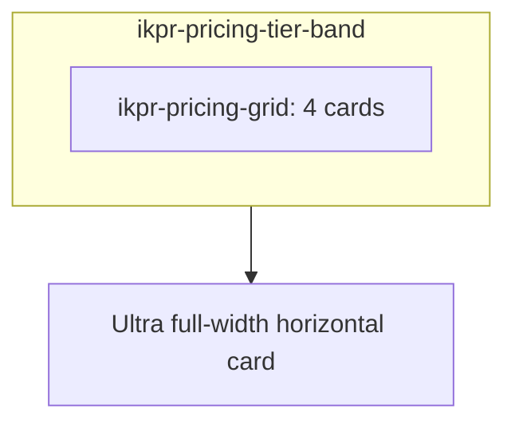

# Platinum tier, Ultra labeling, and horizontal Ultra layout

## Scope (files)

- [pricing.php](c:/Users/googo/Dropbox/_APC/__Current%20Jobs%20(APC)/260307%20-%20ImageKpr/pricing.php): New Platinum column card after Gold; move the current Pro (`ikpr-pricing-card--pro`) article **outside** `.ikpr-pricing-grid` into its own full-width wrapper; change visible title to **Ultra**; refresh intro copy and Gold “Included” lines so Platinum is the top self-serve tier.
- [styles.css](c:/Users/googo/Dropbox/_APC/__Current%20Jobs%20(APC)/260307%20-%20ImageKpr/styles.css): Keep `.ikpr-pricing-grid` at **4 columns** + 7-row subgrid for Free/Silver/Gold/Platinum only; add Platinum surface styles; add a wrapper (e.g. `.ikpr-pricing-tier-band` + `.ikpr-pricing-ultra-band`) and **horizontal** rules for Ultra (desktop grid/flex with distinct columns: lead / mockup / summary / CTA; stack on small viewports); update hover selectors that currently special-case `.ikpr-pricing-card--pro` so the horizontal card still matches intent.
- [inc/admin.php](c:/Users/googo/Dropbox/_APC/__Current%20Jobs%20(APC)/260307%20-%20ImageKpr/inc/admin.php): Extend the product matrix and operational helpers:
  - `imagekpr_allowed_upload_size_tiers_mb()`: add **500** (Platinum per-file cap).
  - `imagekpr_plan_tier_matrix_reference()`: add **`platinum`** row with `upload_mb` 500, `storage_bytes` **10737418240** (10×1024³, same binary style as existing caps), `max_images` **10000**, `shared_dashboard_cap` **2000**; keep dedicated tier keyed **`pro`** with `label` staying **`Pro`** for audit/admin strings and add a **`display_label` => 'Ultra'`** (or equivalent) used only where customers see the name.
  - `imagekpr_plan_tier_storage_reference()`: include **`platinum`** in the preset loop so admin “Apply preset” / bulk preset accept `saas_tier=platinum` (audit log continues to store the **preset key** `platinum`, not the word “Ultra”).
  - `imagekpr_admin_html_plan_matrix_saas_blurb()`: include Platinum in the generated admin help line.
  - `imagekpr_admin_html_plan_matrix_pro_blurb()`: render the dedicated tier using **Ultra** for readers (`display_label`) while the array key remains `pro`.
- [inc/tiers.php](c:/Users/googo/Dropbox/_APC/__Current%20Jobs%20(APC)/260307%20-%20ImageKpr/inc/tiers.php): Update `imagekpr_dashboard_limit_for_tier()` so **upload_size_mb ≥ 500 → 2000**, keeping existing thresholds for 50 / 10 / free.
- [admin/index.php](c:/Users/googo/Dropbox/_APC/__Current%20Jobs%20(APC)/260307%20-%20ImageKpr/admin/index.php):
  - Replace the coarse `SUM(upload_size_mb >= 50) AS gold_count` with **mutually exclusive** buckets (e.g. `=3`, `=10`, `=50`, `=500`, optional “other” / custom) so Platinum users are not counted as Gold.
  - Replace hardcoded `$maxImages = $uploadMb >= 50 ? 1000 : …` with logic derived from the matrix (e.g. small helper in `inc/admin.php` like `imagekpr_plan_max_images_for_upload_mb(int $mb): ?int` keyed off known `upload_mb` values, returning `null` for unknowns) so **500 → 10000** stays in sync with [inc/admin.php](c:/Users/googo/Dropbox/_APC/__Current%20Jobs%20(APC)/260307%20-%20ImageKpr/inc/admin.php).
  - Extend the dashboard limit column to use `imagekpr_dashboard_limit_for_tier()` (already correct once `tiers.php` is updated).
- [account.php](c:/Users/googo/Dropbox/_APC/__Current%20Jobs%20(APC)/260307%20-%20ImageKpr/account.php): Treat **`platinum`** like other SaaS presets for caps copy; widen the “does not match Free, Silver, or Gold” message to include **Platinum**; set the unlimited-plan display label to **Ultra** (replacing the current literal `'Pro'`).
- [admin/config.php](c:/Users/googo/Dropbox/_APC/__Current%20Jobs%20(APC)/260307%20-%20ImageKpr/admin/config.php): Adjust static copy that still says “Free/Silver/Gold” only, if present next to the matrix blurbs.

## Pricing page structure

- **Row 1:** `.ikpr-pricing-grid` contains Free, Silver, Gold, Platinum (same vertical section order as today’s cards: icon → title → price → mockup → upgrades → included → CTA).
- **Row 2:** Single `<article class="ikpr-pricing-card ikpr-pricing-card--pro ikpr-pricing-card--ultra-wide">` (or similar) with an inner layout wrapper so CSS can place **icon/title/price**, **laptop mockup**, **summary list**, and **CTA** in a left-to-right flow on large screens.

## Naming convention (“backend still Pro”)

- **Keep** the associative key **`pro`** in `imagekpr_plan_tier_matrix_reference()` and **keep** CSS hook **`ikpr-pricing-card--pro`** so code and styles remain “Pro” internally.
- **Customer-facing strings** (pricing `<h2>`, dedicated blurb, account unlimited label): show **Ultra**, sourced from `display_label` (or a tiny helper) so you do not duplicate literals across files.

## Currency on Platinum

- Existing tiers on the page use **S$**; plan default is **S$49.90 / month** and **S$499/yr** to stay consistent. If you intend USD, swap the prefix in `pricing.php` only.

## Testing / verification (after implementation)

- Load `pricing.php` at ≥1100px and &lt;600px: four-column band aligns; Ultra band reads clearly and does not break subgrid on the four cards.
- Admin: new preset appears in bulk + per-user apply; applying Platinum sets `upload_size_mb=500` and `storage_quota_bytes=10737418240`.
- `whoami` / dashboards: `dashboardImageLimit` reflects **2000** when `upload_size_mb` is 500 (and still respects downgrade grace rules in [inc/tiers.php](c:/Users/googo/Dropbox/_APC/__Current%20Jobs%20(APC)/260307%20-%20ImageKpr/inc/tiers.php)).
