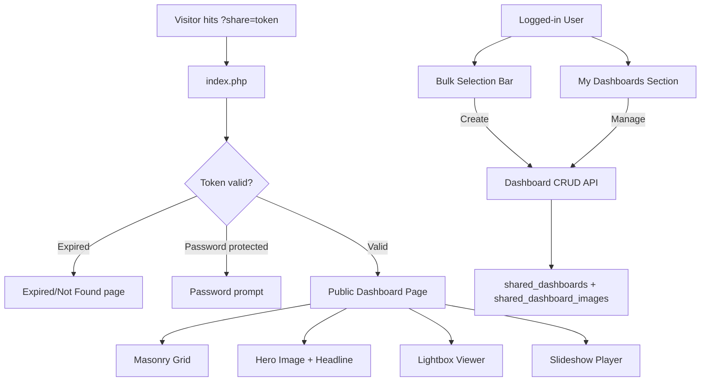

# Shared Dashboard Feature

## Architecture Overview

The shared dashboard is a public-facing page served from the same `index.php` entry point, intercepted early via `?share=<token>` before any auth checks. It requires new database tables, CRUD API endpoints, a creation/management UI in the app, and a standalone public page with its own CSS/JS.




---

## 1. Database Schema

New migration file: `migrations/phase17_shared_dashboards.sql`

`**shared_dashboards` table:**

- `id` INT AUTO_INCREMENT PRIMARY KEY
- `user_id` INT NOT NULL (FK to `users.id`)
- `token` VARCHAR(32) UNIQUE NOT NULL (random URL-safe token)
- `title` VARCHAR(255) DEFAULT NULL (headline)
- `subtitle` VARCHAR(500) DEFAULT NULL (sub-headline)
- `hero_image_id` INT DEFAULT NULL (FK to `images.id`)
- `allow_download` TINYINT(1) DEFAULT 1
- `password_hash` VARCHAR(255) DEFAULT NULL (bcrypt, paid tier only)
- `expires_at` DATETIME DEFAULT NULL (NULL = never expires)
- `view_count` INT DEFAULT 0 (schema-ready for future analytics)
- `last_viewed_at` DATETIME DEFAULT NULL
- `created_at` DATETIME DEFAULT CURRENT_TIMESTAMP
- `updated_at` DATETIME DEFAULT CURRENT_TIMESTAMP ON UPDATE CURRENT_TIMESTAMP

`**shared_dashboard_images` table:**

- `id` INT AUTO_INCREMENT PRIMARY KEY
- `dashboard_id` INT NOT NULL (FK to `shared_dashboards.id`, CASCADE DELETE)
- `image_id` INT NOT NULL (FK to `images.id`)
- `sort_order` INT DEFAULT 0
- UNIQUE KEY on (`dashboard_id`, `image_id`)

---

## 2. Backend API Endpoints

All under `api/dashboards.php` (single file, method-routed):

- **GET** `api/dashboards.php` -- List current user's dashboards (for "My Dashboards" section)
- **GET** `api/dashboards.php?id=X` -- Get single dashboard detail + images (owner only)
- **POST** `api/dashboards.php` (action=create) -- Create dashboard with image IDs, title, hero, expiry, download toggle, password
- **POST** `api/dashboards.php` (action=update) -- Update dashboard settings, add/remove images
- **POST** `api/dashboards.php` (action=delete) -- Delete dashboard
- **GET** `api/dashboards.php?token=X` -- Public fetch (no auth required) -- returns dashboard data + image URLs if valid/not expired. Increments `view_count` and `last_viewed_at` on access.

Key validation rules:

- **Per-dashboard image cap** (each dashboard has its own limit; multiple dashboards do not share one pool):
  - **Free:** max **20** selected images per dashboard
  - **Paid (Silver/Gold on shared SaaS):** **unlimited**
  - **Pro (white-label):** N/A on shared app (dedicated deployment)
- Password field only accepted from paid tier users (check `users.upload_size_mb` or a future billing `plan_tier` column — **interim:** treat `upload_size_mb >= 10` as paid, which matches **Silver and Gold** in the Stripe tier matrix; Free stays `3`. Do **not** use `>= 100` — that would exclude Silver.)
- Expiry presets: 1h, 24h, 7d, 30d, 90d, never, or custom datetime
- Downgrade handling: keep dashboards intact; apply **30-day grace**; after grace, auto-trim to allowed limit by `images.date_uploaded ASC, images.id ASC`

---

## 3. Entry Point Routing ([index.php](index.php))

Insert a share-page intercept **before** the login check (around line 10-15 of `index.php`):

```php
if (!empty($_GET['share'])) {
    require __DIR__ . '/inc/shared_dashboard.php';
    exit;
}
```

This ensures shared dashboards are accessible without any session/login.

---

## 4. Public Dashboard Page (`inc/shared_dashboard.php`)

This file handles the full public-facing page:

1. Validate token against `shared_dashboards` table
2. Check expiry (`expires_at` -- if past, show "This link has expired" page)
3. If password-protected, check `$_SESSION['dash_unlocked_<id>']` or show password form
4. Fetch images via `shared_dashboard_images` JOIN `images`
5. Render standalone HTML page with:

**Page structure:**

- Compact hero section with selected hero image, `title`, `subtitle`, and prominent expiry badge
- "Powered by ImageKpr" fixed bottom-corner badge (free tier only; hidden for paid tier owners)
- Masonry image grid below hero
- Visitor toolbar/actions only from owner permissions: `Start Slideshow`, `Download` (single/all), expiry info
- Lightbox modal: click image to open; top-right has **Copy URL + counter** only; desktop arrows + mobile swipe
- Slideshow player (reuse slideshow logic from `app.js`, adapted for standalone)
- If password-protected and locked: show hero/meta/password UI and keep image region empty until unlock

**Styling:** New section in `styles.css` with `.shared-dash-`* prefix, or a dedicated `shared-dashboard.css`. Masonry via CSS columns (`column-count` + `break-inside: avoid`) for simplicity (no JS library needed).

---

## 5. App UI - Dashboard Creation & Management

### 5a. Bulk Selection Bar Addition ([index.php](index.php) bulk bar area)

Add a primary "Create Dashboard" button next to existing "Slideshow" button in the bulk actions bar. Clicking opens a **top slide-down Dashboard Editor** (~50% viewport height) with:

- Title input (headline)
- Subtitle input (sub-headline)  
- Hero image picker (thumbnail strip of selected images, click to pick)
- Expiry selector (preset dropdown + custom datetime picker)
- Allow downloads toggle
- Password field (shown only for paid tier users)
- "Create & Copy Link" button
- Auto-save for edits once dashboard is created

### 5b. My Dashboards Section

A new owner mode in top nav: yellow toggler between `Manage Folders` and `Manage Dashboard`. In dashboard mode, show cards grid with:

- Card metadata: title, image count, updated date, expiry status, capability badges, views placeholder
- Card actions: Copy link, Show QR (separate), Edit, Delete (simple confirm)
- Click edit: open the same top slide-down editor; if another editor is open, always confirm before switching
- Auto-save edits: title, subtitle, toggles, expiry, ordering
- Add/remove images (image picker from user's library)
- Visual indicators: expired and over-limit badges (for downgrade grace flow)

### 5c. Frontend JS

Add dashboard management functions to [app.js](app.js):

- `createDashboard()` -- collect settings from modal, POST to API, copy link to clipboard
- `loadMyDashboards()` -- fetch and render dashboard list
- `editDashboard(id)` -- open edit modal, populate with existing data
- `deleteDashboard(id)` -- confirm and delete
- Dashboard settings modal HTML added to [index.php](index.php)

---

## 6. Public Page JS (inline or separate file)

The public dashboard page needs lightweight JS for:

- **Masonry layout** -- CSS-only with `column-count` (responsive: 1 col mobile, 2-3 tablet, 4 desktop)
- **Lightbox** -- modal overlay with full-size image, prev/next, keyboard nav (arrow keys, Esc)
- **Minimal interaction model** -- no persistent selection UX for visitors
- **Copy link** -- lightbox top-right icon copies image URL and shows toast
- **Download** -- single download + download-all ZIP (when owner allows)
- **Slideshow** -- self-contained slideshow player (extract core logic from `app.js` slideshow into a reusable snippet)
- **Mobile UX** -- sticky bottom action bar for slideshow/download actions

---

## 7. Tier Detection

Until Stripe billing columns exist, define a helper in [inc/auth.php](inc/auth.php) or a new `inc/tiers.php`:

```php
function imagekpr_user_is_paid($pdo, $user_id) {
    $stmt = $pdo->prepare('SELECT upload_size_mb FROM users WHERE id = ?');
    $stmt->execute([$user_id]);
    $row = $stmt->fetch();
    // Interim proxy: Free = 3 MB, Silver = 10, Gold = 100 — Silver and Gold are both "paid"
    return $row && (int) $row['upload_size_mb'] >= 10;
}
```

**After Stripe:** replace this with a canonical check (e.g. `plan_tier` `free` / `silver` / `gold` on the **shared SaaS**, or active subscription) so paid status does not depend on upload MB alone. **`pro` on SaaS** may exist only for CRM if you track white-label sales; **Pro buyers** normally do not consume shared-app tiers (dedicated deployment). See [Stripe paid tier plan](stripe_paid_tier_upgrade_e2f8b7f0.plan.md).

This gates: **password protection** and **"Powered by" badge** (paid = Silver+ on **shared SaaS**). **Per-dashboard image caps** for now: **Free 20**, **Paid unlimited**. Until `plan_tier` exists, infer from `upload_size_mb`: **3 → Free (20)**, **>=10 → Paid (unlimited)**.

---

## 8. Security Considerations

- Tokens: 22-char base62 random string (cryptographically secure via `random_bytes`)
- Password hashing: `password_hash()` / `password_verify()` with bcrypt
- Dashboard API endpoints validate ownership (`user_id` match) for all mutations
- Public endpoint only returns image URLs and dashboard metadata, never user details
- Rate limit on password attempts (reuse existing `inc/rate_limit.php`)
- Expired dashboards return 410 Gone, not 404 (distinguishes "never existed" from "expired")

---

## Files to Create/Modify

**New files:**

- `migrations/phase17_shared_dashboards.sql` -- schema
- `api/dashboards.php` -- CRUD + public fetch API
- `inc/shared_dashboard.php` -- public page renderer (HTML/CSS/JS)
- `inc/tiers.php` -- tier detection helper

**Modified files:**

- [index.php](index.php) -- share token intercept + dashboard creation modal HTML + "My Dashboards" section + bulk bar button
- [app.js](app.js) -- dashboard CRUD functions, modal handlers, My Dashboards UI
- [styles.css](styles.css) -- dashboard modal styles, My Dashboards section styles
- [inc/auth.php](inc/auth.php) -- minor: allow unauthenticated access to dashboard API public endpoint

