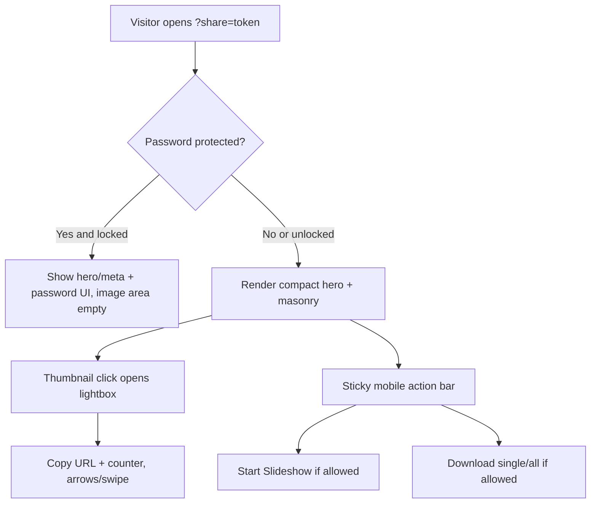

# Shared Dashboard Plan Update (Final Visitor UX)

## Locked Visitor UX Decisions

The shared dashboard visitor experience is now defined as follows:

- Compact hero section at top (image discovery prioritized).
- Clicking a thumbnail opens lightbox immediately.
- Lightbox top-right includes:
  - copy URL icon
  - image counter (`current/total`)
- Lightbox excludes owner/admin actions (no delete, rename, tag edit, etc.).
- Navigation:
  - desktop: arrow controls
  - mobile: swipe gestures
- Selection model: minimal quick mode (no heavy persistent multi-select UI).
- Download behavior (if owner enabled):
  - download single image
  - download all images (ZIP)
- Expiry info shown as a prominent badge.
- Mobile layout:
  - hero first
  - sticky bottom action bar for key actions
- Empty/locked/unavailable states use friendly branded CTA tone.
- Free-tier branding watermark is fixed at bottom corner.

---

## Owner UI Decisions Already Locked

- Owner-only yellow top-nav toggler between:
  - `Manage Folders`
  - `Manage Dashboard`
- `Create Dashboard` from blue selection bar opens a slide-down panel from top (~50% viewport).
- Grid remains visible and usable while panel is open.
- `Manage Dashboard` default view is a cards grid.
- Reordering supported in both:
  - slideshow-like thumbnail strip
  - dashboard-mode grid drag/drop
- Save model is auto-save.
- Owner dashboard toggles:
  - slideshow allowed
  - download allowed
  - expiry date vs never
  - password (paid-tier only)
- Card actions:
  - Copy link
  - Show QR (separate action)
  - Edit
  - Delete (simple confirm)
- If another dashboard is clicked while editor is open, always prompt before switching.
- Over-limit downgrade warning appears as badge on affected cards.

---

## Public Page Behavior Contract

### Before password unlock (when protected)

- Show hero/title/subtitle + metadata (including expiry badge).
- Show password input UI.
- Keep image region empty until successful unlock.

### After unlock (or if no password)

- Render masonry image feed.
- Render visitor controls conditionally from owner permissions:
  - `Start Slideshow` (if enabled)
  - `Download` controls (if enabled)
  - expiry badge (always)

---

## Data/API Fields (Updated)

Dashboard-level settings to persist:
- `allow_slideshow` (bool)
- `allow_download` (bool)
- `expires_at` (nullable datetime)
- `password_hash` (nullable)
- `hero_image_id`
- `title`, `subtitle`

Public payload fields:
- `is_password_protected`
- `can_slideshow`
- `can_download`
- `expires_at`
- `never_expires`
- `watermark_required`
- image list with canonical normalized URLs and stable order

---

## UX Components to Build

In [`index.php`](index.php), [`app.js`](app.js), [`styles.css`](styles.css), and new public renderer file:

1. Owner top-nav yellow mode switch.
2. Slide-down dashboard editor panel (~50vh desktop, responsive on mobile).
3. Synchronized reorder system (strip + grid).
4. Visitor lightbox with:
   - top-right copy icon + counter
   - desktop arrows, mobile swipe.
5. Mobile sticky bottom action bar on visitor page.
6. Branded empty/locked/expired states.
7. Fixed corner watermark for free-tier shared dashboards.

---

## Entitlement & Downgrade Rules (Carry Forward)

No change to prior policy:
- free: max 20 images per dashboard
- paid: unlimited
- downgrade: 30-day grace (no immediate deletion)
- post-grace auto-trim by oldest uploaded (`date_uploaded ASC`, tie-break `id ASC`)

All gating must use canonical entitlement helper to remain Stripe-ready.

---

## One Pending Micro-Decision

Copy action in lightbox is now fixed: copy **individual image URL**.

