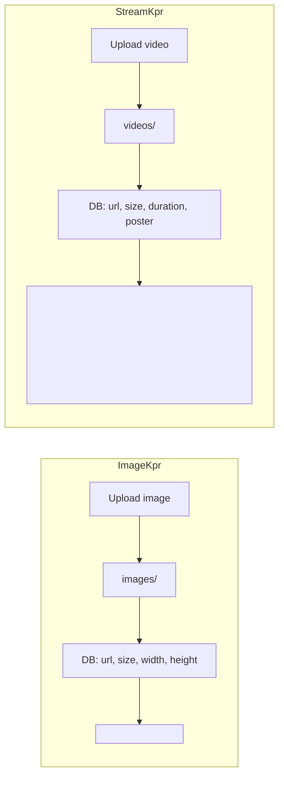

# StreamKpr Video Repository — Feasibility Study

## Verdict: Feasible

StreamKpr is well-suited to the same LAMP (PHP + MySQL) architecture as ImageKpr. You can store videos on your server and play them in-browser using the HTML5 `<video>` element. The mental model is nearly identical: files on disk, metadata in MySQL, URLs for playback.

---

## Architecture Comparison




---

## What Transfers Directly from ImageKpr

- **Stack**: LAMP, vanilla JS, no build step — same deploy story
- **Database pattern**: Table like `videos` (id, filename, url, date_uploaded, size_bytes, duration_seconds, poster_url, tags)
- **API layout**: list, upload, delete, tags, stats — same endpoints, different file types
- **UI flow**: grid, modal, folders (localStorage), search, sort, bulk actions
- **Hot folder / inbox**: FTP drop → import — same idea for videos

---

## What Changes for Video

### 1. File size and upload limits


| Aspect                | ImageKpr | StreamKpr                          |
| --------------------- | -------- | ---------------------------------- |
| Max per file          | 3 MB     | 100 MB–2 GB+                       |
| `upload_max_filesize` | 3 MB     | 256 MB–2 GB                        |
| `post_max_size`       | Same     | Same                               |
| Timeouts              | Default  | May need `max_execution_time` 300+ |


Most shared hosts cap uploads at 64–128 MB. For larger files you’ll need:

- **Chunked uploads** (JS slices file, PHP appends chunks)
- **Direct-to-storage uploads** (S3/Blob, pre-signed URLs)
- Or keep limits moderate (e.g. < 500 MB) and accept hosting constraints

### 2. Browser playback

HTML5 `<video>` works with direct file URLs:

```html
<video src="https://yoursite.com/videos/my-video.mp4" controls preload="metadata"></video>
```

Supported formats:

- **MP4 (H.264)** — best compatibility (Safari, Chrome, Firefox, mobile)
- **WebM (VP8/VP9)** — Chrome, Firefox
- **OGG** — older Firefox

Recommendation: store MP4 (H.264) as the primary format. If users upload other formats, you can either:

- Reject non-MP4, or  
- Transcode server-side with FFmpeg (optional, requires shell access)

### 3. Progressive download vs streaming

- **Progressive download** (what `<video src="...">` does): browser downloads from start to end as the user watches. Works well for < 500 MB files on decent connections. No extra server logic.
- **Adaptive streaming (HLS/DASH)**: segments, multiple bitrates, seek without full download. Requires transcoding (FFmpeg) and segment storage. Only needed for large files, many users, or adaptive quality.

For a personal/small-team app, progressive download is usually enough.

### 4. Thumbnails / posters

ImageKpr uses full images in the grid. For videos you need a preview image. Options:

- **Poster frame**: extract one frame with FFmpeg (or `getID3`/`php-ffmpeg`) and store `poster_url`
- **Placeholder**: use a generic video icon if you skip server-side thumbnail generation

### 5. Duration

Store `duration_seconds` in the DB. Extract with:

- **FFmpeg** (best, needs CLI access)
- **getID3** PHP library (no shell required, reads metadata)

---

## Hosting Considerations


| Factor           | Shared hosting  | VPS / dedicated |
| ---------------- | --------------- | --------------- |
| Upload limit     | Often 64–128 MB | Configurable    |
| FFmpeg           | Usually absent  | Available       |
| Disk / bandwidth | Limited         | Scalable        |
| Chunked uploads  | Works           | Works           |


- **Shared hosting**: Keep videos < 64 MB or use a chunked-upload solution.
- **VPS / dedicated**: Full control for large files, FFmpeg, and optional transcoding.

---

## Suggested StreamKpr Schema

```sql
CREATE TABLE videos (
  id INT AUTO_INCREMENT PRIMARY KEY,
  filename VARCHAR(255) NOT NULL UNIQUE,
  url VARCHAR(512) NOT NULL,
  date_uploaded DATETIME NOT NULL,
  size_bytes BIGINT UNSIGNED NOT NULL,
  duration_seconds INT UNSIGNED NULL,
  poster_url VARCHAR(512) NULL,
  width INT UNSIGNED NULL,
  height INT UNSIGNED NULL,
  tags JSON,
  INDEX idx_date (date_uploaded),
  INDEX idx_size (size_bytes)
);
```

---

## Implementation Effort (rough)

- **MVP (progressive download, < 100 MB, no thumbnails)**: ~2–3 days if you copy ImageKpr structure
- **With poster frames (FFmpeg)**: +1–2 days
- **Chunked uploads for large files**: +2–3 days
- **Optional HLS/DASH streaming**: +1–2 weeks

---

## Summary


| Question                             | Answer                                                        |
| ------------------------------------ | ------------------------------------------------------------- |
| Can you store videos on your server? | Yes                                                           |
| Can you play them in the browser?    | Yes, with `<video src="url">`                                 |
| Same stack as ImageKpr?              | Yes                                                           |
| Main difference?                     | Larger files, higher PHP limits, optional thumbnails/duration |
| Optional complexity?                 | Chunked uploads, transcoding, adaptive streaming              |


**Bottom line:** A StreamKpr MVP that stores videos and plays them in-browser is very feasible. Keep file sizes modest or use a VPS and chunked uploads for large files.